# 自作ガウシアン


```python
def gauss(x, a, mu, si, nf):
    """
    a: 最大値
    mu: 位置
    si: 線幅
    noisef: 最低値
    """
    return a * np.exp(-(x - mu)**2 / 2 / si**2) + nf
```


```python
nf=0.5
n=1001
x = np.linspace(0,100,n)
a, mu, si = 1, 50, 1
```


```python
g= gauss(x, a, mu, si, nf); g
```


    array([ 0.5,  0.5,  0.5, ...,  0.5,  0.5,  0.5])


```python
plt.plot(x, g)
```


    [<matplotlib.lines.Line2D at 0x1a177d2bc88>]


## 自作ガウシアンじゃなくてscipy.stats.normを使うべきでは


```python
from  scipy.stats import norm
```


```python
z=norm.pdf(x, loc=50, scale=1)-0.5; z
```


    array([-0.5, -0.5, -0.5, ..., -0.5, -0.5, -0.5])


```python
plt.plot(x,z)
```


    [<matplotlib.lines.Line2D at 0x1e4a95df9e8>]


```python
a, mu, si=1, 50, 1
df=pd.DataFrame({'norm': a*norm.pdf(x, loc=mu, scale=si)+nf,
                 			'gauss': gauss(x, a, mu, si, nf)})
df.plot(style=['-', '--'])
```


    <matplotlib.axes._subplots.AxesSubplot at 0x148c87f5710>


## norm vs my_gauss
normでも自作gaussでも中でnp使っているんで実行速度あんま変わらないだろうとテスト


```python
%timeit gauss(x, a, mu, si)
```

    The slowest run took 5.79 times longer than the fastest. This could mean that an intermediate result is being cached.
    10000 loops, best of 3: 59.8 µs per loop
    


```python
%timeit norm.pdf(x, loc=50, scale=1)-0.5
```

    The slowest run took 5.26 times longer than the fastest. This could mean that an intermediate result is being cached.
    1000 loops, best of 3: 218 µs per loop
    

自作ガウスのほうが早い…！

## ガウシアンに沿ってノイズを作る

ということで自作のガウシアンを使っていきます。


```python
g = gauss(x, a, mu, si, 0.5)
gnoise = g + 0.1 * g * np.random.randn(n)
```


```python
plt.plot(x, gnoise, '-')
plt.plot(x, g,'b-' )
```


    [<matplotlib.lines.Line2D at 0x1a177c5bcf8>]


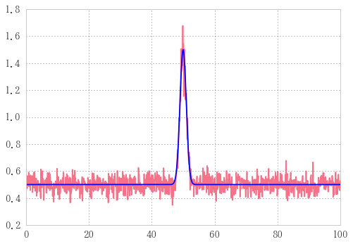


ノイズを発生させる

## カーブフィッティングをかけて、ノイズをフィッティングする

gからgnoiseを導き出したのだけれども、ここで急にgを未知の関数とみなしてしまう。
今あなたはgnoiseだけを知っていて、gのような関数を得たいとき、どうするか。

こういう時はカーブフィットを取る。
scipy.optimizeからcurve_fitをインポートしてくる。


```python
from scipy.optimize import curve_fit
from scipy.optimize import leastsq
from scipy.optimize import least_squares
from scipy.stats import scoreatpercentile
```

次にフィッティングパラメータを定める。


```python
(a_, mu_, si_, nf_), _ = curve_fit(gauss, x, gnoise, p0=(a, mu, si, nf))
yfit = gauss(x, a_, mu_, si_, nf)  # フィッティングにより導き出されたa,mu,siを代入
print('元パラメータ:%s\nフィッティングで求めたパラメータ: %s' % ((a, mu , si), (a_, mu_, si_)))
```

    元パラメータ:(1, 50, 1)
    フィッティングで求めたパラメータ: (0.98288835192385138, 49.983822066353746, 0.99222230410189216)
    


```python
_
```


    array([[  2.69528582e-04,   1.34053555e-10,  -1.71228319e-04,
             -2.27783859e-06],
           [  1.34053555e-10,   3.40470185e-04,  -1.30160080e-10,
             -1.16627832e-14],
           [ -1.71228319e-04,  -1.30160080e-10,   3.46610735e-04,
             -4.44756457e-06],
           [ -2.27783859e-06,  -1.16627832e-14,  -4.44756457e-06,
              3.22135030e-06]])


curve_fitの戻り値アンダーバーは共分散？

    pcov : 2d array
    The estimated covariance of popt. The diagonals provide the variance
    of the parameter estimate. To compute one standard deviation errors
    on the parameters use ``perr = np.sqrt(np.diag(pcov))``.


```python
plt.plot(x, gnoise, 'r-')
plt.plot(x, yfit, 'b-') 
```


    [<matplotlib.lines.Line2D at 0x1a1796a6828>]


さっきと同じグラフに見えるが、描いているのはgではなくyfitであることに注意

同じグラフに見えるということはフィッティングできたということ。

# scipy.stats.normを使った場合

## ガウシアンに沿ってノイズを作る


```python
from  scipy.stats import norm
```


```python
n=1001
xx = np.linspace(0,100,n)
aa, mu, si = 5, 50, 1
```


```python
def gauss2(x, a, mu, si):
    return a*norm.pdf(x, loc=mu, scale=si)-noisef
```


```python
g = gauss2(xx, aa, mu, si)
gnoise = g + 0.1 * np.random.randn(n)
```


```python
plt.plot(xx, gnoise, '.-')
plt.plot(xx, g,'r-' )
```


    [<matplotlib.lines.Line2D at 0x1ca7b0647f0>]


## カーブフィッティングをかけて、ノイズをフィッティングする

gからgnoiseを導き出したのだけれども、ここで急にgを未知の関数とみなしてしまう。
今あなたはgnoiseだけを知っていて、gのような関数を得たいとき、どうするか。


```python
from scipy.optimize import curve_fit
(aa_, mu_, si_), _ = curve_fit(gauss2, xx, gnoise, (aa, mu, si))
yfit = gauss2(xx,aa_, mu_, si_)
```


```python
plt.plot(xx, gnoise, '.-')
plt.plot(xx, yfit, 'r-')  # 描いているのはgではなく、yfitであることに注意
```


    [<matplotlib.lines.Line2D at 0x1ca7b1252e8>]


ちゃんとフィッティングできた。

# 自作ガウスをノイズのあるデータフレームにcarve_fitをapply

## ランダムデータフレームの作成


```python
r=np.random
```

いっぱい使うから乱数生成をrに縮めちゃう


```python
g = gauss(x, a=r.rand(), mu=10*1, si=10*r.rand(), nf=nf*r.rand())
plt.plot(x, g)
```


    [<matplotlib.lines.Line2D at 0x1a1782dae80>]


ランダムな値を使って発生させたガウシアン


```python
%%timeit
df = pd.DataFrame([], index=range(1000))
for i in np.arange(min(x), max(x), 10):
    g = gauss(x, a=r.rand(), mu=i, si=10*r.rand(), noisef=nf)
    df[i] = pd.DataFrame(g)
```

    100 loops, best of 3: 8.69 ms per loop
    

まず思いつくforループ


```python
%%timeit
garray = np.array([gauss(x, a=r.rand(), mu=i, si=10*r.rand(), noisef=nf)
                    for i in np.arange(min(x), max(x), 10)]).T
df = pd.DataFrame(garray)
```

    1000 loops, best of 3: 743 µs per loop
    

リスト内包表記を使うことでより高速


```python
%%timeit
xa = np.tile(x, (10,1))
aa = abs(r.randn(10))
mua = np.arange(min(x), max(x), 10)
sia = 10 * abs(r.randn(10))

df = pd.DataFrame(gauss(xa.T, aa, mua, sia, nf))
```

    1000 loops, best of 3: 604 µs per loop
    

np.arrayで変数作るともっともっと高速


```python
xa = np.tile(x, (10,1))
aa = abs(r.randn(10))
mua = np.arange(min(x), max(x), 10)
sia = 10 * abs(r.randn(10))

df = pd.DataFrame(gauss(xa.T, aa, mua, sia, nf))
```


```python
df.plot()
```


    <matplotlib.axes._subplots.AxesSubplot at 0x1a1782ad518>


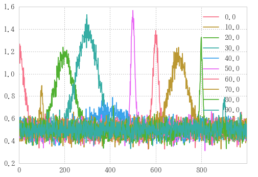


様々な形のガウシアン。

ノイズフロアは一定にした。

こいつらにノイズを載せる。

## ランダムデータフレームにノイズのせてサンプルデータ作成


```python
noisedf =df + df * 0.05 * r.randn(*df.shape)
noisedf.plot()
```


    <matplotlib.axes._subplots.AxesSubplot at 0x1a1783d5198>


5%のノイズをのせた。
`np.randn(*df.shape)`でデータフレームと同じ行列を持ったランダムデータフレームを生成させている。
スターを`df.shape`の前につけてタプルを展開して`randn`に渡す。


```python
sumdf = noisedf.sum(axis=1)
sumdf.plot()
```


    <matplotlib.axes._subplots.AxesSubplot at 0x1de4c436320>


```python
sumdf
```


    0       5.432676
    1       5.605698
    2       5.298539
    3       5.522210
    4       5.598536
    5       5.628876
    6       5.590488
    7       5.520159
    8       5.357040
    9       5.524325
    10      5.352305
    11      5.252700
    12      5.442083
    13      5.357631
    14      5.633205
    15      5.394023
    16      5.485547
    17      5.300434
    18      5.472389
    19      5.403377
    20      4.983068
    21      5.330210
    22      5.274541
    23      5.166913
    24      5.551668
    25      5.476331
    26      5.108893
    27      4.984221
    28      5.214877
    29      5.402299
              ...   
    971     5.363341
    972     5.478791
    973     5.665920
    974     5.777761
    975     5.737976
    976     5.659097
    977     5.625246
    978     5.545209
    979     5.726983
    980     5.747878
    981     5.479815
    982     5.714544
    983     5.406541
    984     5.325538
    985     5.532115
    986     5.222370
    987     5.502674
    988     5.481744
    989     5.548988
    990     5.690841
    991     5.502521
    992     5.599736
    993     5.366537
    994     5.508551
    995     5.497639
    996     5.128502
    997     5.403535
    998     5.350118
    999     5.540160
    1000    5.401792
    dtype: float64


indexはそのままにカラムをすべて足す。この中でindexいくつの位置にガウシアンが立つかを調べる。

## 複数のランダムウェーブを生成


```python
def waves(seed: int=np.random.randint(100)):
    """ランダムノイズを発生させたウェーブを作成する
    引数: seed: ランダムステートを初期化する整数。デフォルトでseedをランダムに発生させる
    戻り値: noisedf.sum(1): pd.Series型"""
    r = np.random
    r.seed(seed)  # ランダム初期化
    xa = np.tile(x, (10,1))
    aa = abs(r.randn(10))
    mua = np.arange(min(x), max(x), 10)
    sia = 10 * abs(r.randn(10))

    df = pd.DataFrame(gauss(xa.T, aa, mua, sia, nf))
    noisedf = df + df * 0.05 * r.randn(*df.shape)
    return noisedf.sum(1)
waves().plot()
```


    <matplotlib.axes._subplots.AxesSubplot at 0x28e0a0c9160>


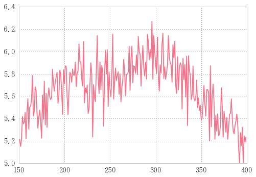


```python
%timeit waves()
```

    100 loops, best of 3: 2.33 ms per loop
    


```python
df = pd.DataFrame([waves(i) for i in range(10)]); df
```


<div>
<table border="1" class="dataframe">
  <thead>
    <tr style="text-align: right;">
      <th></th>
      <th>0</th>
      <th>1</th>
      <th>2</th>
      <th>3</th>
      <th>4</th>
      <th>5</th>
      <th>6</th>
      <th>7</th>
      <th>8</th>
      <th>9</th>
      <th>...</th>
      <th>991</th>
      <th>992</th>
      <th>993</th>
      <th>994</th>
      <th>995</th>
      <th>996</th>
      <th>997</th>
      <th>998</th>
      <th>999</th>
      <th>1000</th>
    </tr>
  </thead>
  <tbody>
    <tr>
      <th>0</th>
      <td>6.945187</td>
      <td>7.108197</td>
      <td>6.845565</td>
      <td>6.948541</td>
      <td>6.845199</td>
      <td>7.055347</td>
      <td>6.977616</td>
      <td>7.056927</td>
      <td>7.079365</td>
      <td>7.138362</td>
      <td>...</td>
      <td>5.352165</td>
      <td>5.237588</td>
      <td>5.368697</td>
      <td>5.147199</td>
      <td>5.197124</td>
      <td>5.213663</td>
      <td>5.317618</td>
      <td>5.263670</td>
      <td>5.266836</td>
      <td>5.319199</td>
    </tr>
    <tr>
      <th>1</th>
      <td>7.133442</td>
      <td>7.059512</td>
      <td>7.190294</td>
      <td>7.232617</td>
      <td>7.261932</td>
      <td>7.016845</td>
      <td>7.189088</td>
      <td>7.295845</td>
      <td>7.185489</td>
      <td>7.022073</td>
      <td>...</td>
      <td>5.166897</td>
      <td>5.017208</td>
      <td>5.075220</td>
      <td>5.214620</td>
      <td>5.136346</td>
      <td>5.049252</td>
      <td>5.014033</td>
      <td>5.049660</td>
      <td>5.022505</td>
      <td>5.217068</td>
    </tr>
    <tr>
      <th>2</th>
      <td>5.348248</td>
      <td>5.553449</td>
      <td>5.548598</td>
      <td>5.538164</td>
      <td>5.430301</td>
      <td>5.412686</td>
      <td>5.579073</td>
      <td>5.552572</td>
      <td>5.647116</td>
      <td>5.415833</td>
      <td>...</td>
      <td>5.104680</td>
      <td>5.207193</td>
      <td>5.014641</td>
      <td>5.061536</td>
      <td>5.125885</td>
      <td>5.072221</td>
      <td>5.181555</td>
      <td>4.908350</td>
      <td>5.057412</td>
      <td>5.102178</td>
    </tr>
    <tr>
      <th>3</th>
      <td>7.274488</td>
      <td>7.426611</td>
      <td>7.076638</td>
      <td>7.595002</td>
      <td>7.723684</td>
      <td>7.506426</td>
      <td>7.210183</td>
      <td>7.406186</td>
      <td>7.584276</td>
      <td>7.486866</td>
      <td>...</td>
      <td>5.332370</td>
      <td>5.272767</td>
      <td>5.421780</td>
      <td>5.499642</td>
      <td>5.210076</td>
      <td>5.363444</td>
      <td>5.385211</td>
      <td>5.220253</td>
      <td>5.466960</td>
      <td>5.286162</td>
    </tr>
    <tr>
      <th>4</th>
      <td>5.086649</td>
      <td>5.070892</td>
      <td>5.054293</td>
      <td>5.011917</td>
      <td>5.164769</td>
      <td>5.146161</td>
      <td>4.921866</td>
      <td>5.057269</td>
      <td>5.123093</td>
      <td>5.084757</td>
      <td>...</td>
      <td>5.065826</td>
      <td>5.150936</td>
      <td>5.078083</td>
      <td>5.028696</td>
      <td>5.064742</td>
      <td>5.037380</td>
      <td>5.331177</td>
      <td>5.131369</td>
      <td>5.206482</td>
      <td>5.235898</td>
    </tr>
    <tr>
      <th>5</th>
      <td>5.380750</td>
      <td>5.546886</td>
      <td>5.502097</td>
      <td>5.557626</td>
      <td>5.416009</td>
      <td>5.364240</td>
      <td>5.585252</td>
      <td>5.475956</td>
      <td>5.528495</td>
      <td>5.392496</td>
      <td>...</td>
      <td>5.354433</td>
      <td>5.439949</td>
      <td>5.550969</td>
      <td>5.281462</td>
      <td>5.491426</td>
      <td>5.382127</td>
      <td>5.453180</td>
      <td>5.208387</td>
      <td>5.277590</td>
      <td>5.423068</td>
    </tr>
    <tr>
      <th>6</th>
      <td>5.629440</td>
      <td>5.443759</td>
      <td>5.531657</td>
      <td>5.720805</td>
      <td>5.500641</td>
      <td>5.665483</td>
      <td>5.582582</td>
      <td>5.677595</td>
      <td>5.435612</td>
      <td>5.648220</td>
      <td>...</td>
      <td>5.288703</td>
      <td>5.109035</td>
      <td>5.229636</td>
      <td>5.267676</td>
      <td>5.134689</td>
      <td>5.277698</td>
      <td>5.236259</td>
      <td>5.066652</td>
      <td>5.206823</td>
      <td>5.181833</td>
    </tr>
    <tr>
      <th>7</th>
      <td>6.827328</td>
      <td>6.582126</td>
      <td>6.744212</td>
      <td>6.905696</td>
      <td>6.514176</td>
      <td>6.890059</td>
      <td>6.824137</td>
      <td>6.794166</td>
      <td>6.634765</td>
      <td>6.680948</td>
      <td>...</td>
      <td>5.532310</td>
      <td>5.495926</td>
      <td>5.500994</td>
      <td>5.431254</td>
      <td>5.448915</td>
      <td>5.520323</td>
      <td>5.463009</td>
      <td>5.670345</td>
      <td>5.523788</td>
      <td>5.370447</td>
    </tr>
    <tr>
      <th>8</th>
      <td>6.417707</td>
      <td>6.429011</td>
      <td>6.475284</td>
      <td>6.290368</td>
      <td>6.670582</td>
      <td>6.636257</td>
      <td>6.427363</td>
      <td>6.455692</td>
      <td>6.620168</td>
      <td>6.508548</td>
      <td>...</td>
      <td>4.998059</td>
      <td>4.907901</td>
      <td>4.900991</td>
      <td>4.984814</td>
      <td>5.011483</td>
      <td>4.939173</td>
      <td>5.053548</td>
      <td>4.868739</td>
      <td>4.874232</td>
      <td>4.905128</td>
    </tr>
    <tr>
      <th>9</th>
      <td>5.285603</td>
      <td>5.404935</td>
      <td>5.279550</td>
      <td>5.060339</td>
      <td>5.276347</td>
      <td>5.236848</td>
      <td>5.305694</td>
      <td>5.347108</td>
      <td>5.337980</td>
      <td>5.361805</td>
      <td>...</td>
      <td>5.626433</td>
      <td>5.572625</td>
      <td>5.647371</td>
      <td>5.480810</td>
      <td>5.495603</td>
      <td>5.535284</td>
      <td>5.492852</td>
      <td>5.550408</td>
      <td>5.592165</td>
      <td>5.344825</td>
    </tr>
  </tbody>
</table>
<p>10 rows × 1001 columns</p>
</div>


# データフレームに一斉にフィッティングかける
一番やりたかったこと　ここから。

## 試しに波を一つ選んでfitting

### 特定範囲を抽出する関数を作成


```python
def choice(array, center, span):
    """特定の範囲を抜き出す
    引数: 
        array: 抜き出し対象のarrayっぽいの(arraylike)
        center: 抜き出し中央(float)
        span: 抜き出しスパン(float)
    戻り値:
        rarray:
    """
    x1 = int(center - span / 2)
    x2 = int(center + span / 2)
    return array[x1:x2]
```


```python
ch = (300, 200)  # 中央値300でスパン200で取り出したい
df0 = choice(df.iloc[0], *ch)
df0.plot()
```


    <matplotlib.axes._subplots.AxesSubplot at 0x28e0a0945c0>


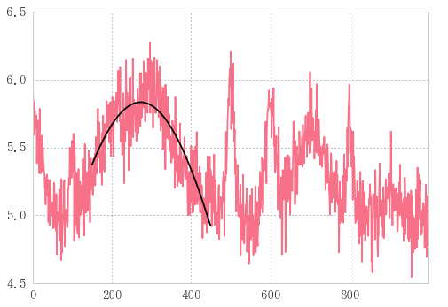


### 一つの波をfitting


```python
param = (a, mu, si, nf) = 5, 300, 3, scoreatpercentile(df0, 25)
param
```


    (5, 300, 3, 6.1943784193082427)


パラメータ再設定


```python
fitx, fity = df0.index, df0.values,
popt, _pcov = curve_fit(gauss, np.array(fitx), fity, p0=param)
print('a, mu, si, nf = ', popt)
```

    a, mu, si, nf =  [   1.64608234  299.80613945    8.94731799    6.44094237]
    

fittingの結果


```python
df.iloc[0].plot(color='gray', lw=0.5)
plt.plot(df0.index, gauss(df0.index, *popt))
plt.plot(popt[1], popt[0]+popt[3] , 'D', fillstyle='none', mew=2)
```


    [<matplotlib.lines.Line2D at 0x28e0a53a278>]


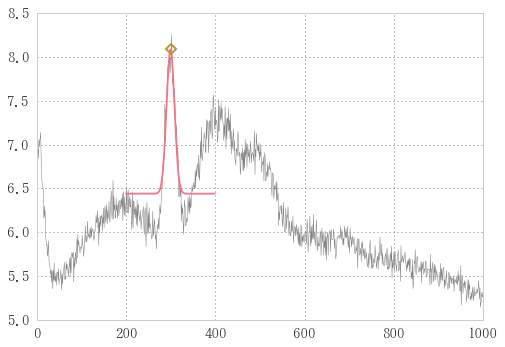


プロットするときは`mu`が横軸、　`a+nf`が縦軸

## df縦方向にfitting
axis=0方向にfitting

意味的には特定周波数を別時間軸上で同時に実行。
`df.apply(curve_fit, args=())`使いたい。


```python
df.T.plot()
plt.plot((100,100, 300, 300, 100), (4.5, 10.5, 10.5, 4.5, 4.5), 'r-')  # 枠線
```


    [<matplotlib.lines.Line2D at 0x28e0a54a7b8>]


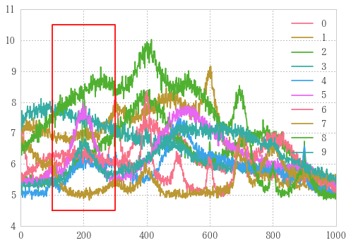


赤枠の中だけ拡大。(その中だけがフィッティング対象)


```python
ch = (300, 200)
dfe = df.apply(choice,axis=1, args=ch)
dfe.T.plot(legend=False)
```


    <matplotlib.axes._subplots.AxesSubplot at 0x28e0b874f28>


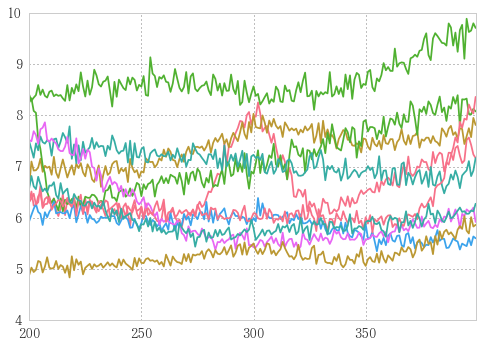


拡大した図

### fitting関数作成


```python
fit = lambda x: curve_fit(gauss, x.index, x.values, p0=param)  # fitting function
fita = dfe.apply(fit, axis=1)
```

フィッティング関数はlambda式で定義して、
applyでデータフレームの各行に適用。


```python
type(fita)
```


    pandas.core.series.Series


```python
fita
```


    0    ([1.64608233941, 299.806139455, 8.94731798894,...
    1    ([1.06720581454, 342.175948763, 77.8097497546,...
    2    ([-1.86034853457, 247.618524866, 71.1429284505...
    3    ([0.119213086912, 301.166378566, 1.38645305185...
    4    ([603.417204075, 231.312304775, 3682.28745173,...
    5    ([-8214.48961119, 324.777372988, 5187.93270244...
    6    ([-10834.1282713, 288.175702378, 7442.99563502...
    7    ([0.167421897449, 299.669427889, 11.8363393835...
    8    ([-10855.5095368, 267.685530085, 9114.65805152...
    9    ([-5964.08199733, 311.71632169, 6258.82944108,...
    dtype: object


fitaはpandas.Seriesだが、一つの要素にタプル形式でフィッティングのパラメータと分散が入っている。

そこで以下のようにして内法表記で分解して第0要素だけ取り出す。


```python
result = pd.DataFrame((i[0] for i in fita), columns=['a', 'mu', 'si', 'nf']); result
```


<div>
<table border="1" class="dataframe">
  <thead>
    <tr style="text-align: right;">
      <th></th>
      <th>a</th>
      <th>mu</th>
      <th>si</th>
      <th>nf</th>
    </tr>
  </thead>
  <tbody>
    <tr>
      <th>0</th>
      <td>1.646082</td>
      <td>299.806139</td>
      <td>8.947318</td>
      <td>6.440942</td>
    </tr>
    <tr>
      <th>1</th>
      <td>1.067206</td>
      <td>342.175949</td>
      <td>77.809750</td>
      <td>6.611884</td>
    </tr>
    <tr>
      <th>2</th>
      <td>-1.860349</td>
      <td>247.618525</td>
      <td>71.142928</td>
      <td>8.390693</td>
    </tr>
    <tr>
      <th>3</th>
      <td>0.119213</td>
      <td>301.166379</td>
      <td>1.386453</td>
      <td>7.093136</td>
    </tr>
    <tr>
      <th>4</th>
      <td>603.417204</td>
      <td>231.312305</td>
      <td>3682.287452</td>
      <td>-597.375350</td>
    </tr>
    <tr>
      <th>5</th>
      <td>-8214.489611</td>
      <td>324.777373</td>
      <td>5187.932702</td>
      <td>8219.951273</td>
    </tr>
    <tr>
      <th>6</th>
      <td>-10834.128271</td>
      <td>288.175702</td>
      <td>7442.995635</td>
      <td>10840.016757</td>
    </tr>
    <tr>
      <th>7</th>
      <td>0.167422</td>
      <td>299.669428</td>
      <td>11.836339</td>
      <td>5.240607</td>
    </tr>
    <tr>
      <th>8</th>
      <td>-10855.509537</td>
      <td>267.685530</td>
      <td>9114.658052</td>
      <td>10863.926883</td>
    </tr>
    <tr>
      <th>9</th>
      <td>-5964.081997</td>
      <td>311.716322</td>
      <td>6258.829441</td>
      <td>5969.772154</td>
    </tr>
  </tbody>
</table>
</div>


フィッティング結果のデータフレーム


```python
result = np.array([i[0] for i in fita]); result
```


    array([[  1.64608234e+00,   2.99806139e+02,   8.94731799e+00,
              6.44094237e+00],
           [  1.06720581e+00,   3.42175949e+02,   7.78097498e+01,
              6.61188409e+00],
           [ -1.86034853e+00,   2.47618525e+02,   7.11429285e+01,
              8.39069261e+00],
           [  1.19213087e-01,   3.01166379e+02,   1.38645305e+00,
              7.09313574e+00],
           [  6.03417204e+02,   2.31312305e+02,   3.68228745e+03,
             -5.97375350e+02],
           [ -8.21448961e+03,   3.24777373e+02,   5.18793270e+03,
              8.21995127e+03],
           [ -1.08341283e+04,   2.88175702e+02,   7.44299564e+03,
              1.08400168e+04],
           [  1.67421897e-01,   2.99669428e+02,   1.18363394e+01,
              5.24060726e+00],
           [ -1.08555095e+04,   2.67685530e+02,   9.11465805e+03,
              1.08639269e+04],
           [ -5.96408200e+03,   3.11716322e+02,   6.25882944e+03,
              5.96977215e+03]])


フィッティング結果のnp.array

### fitting結果を描く


```python
df.T.plot()
```


    <matplotlib.axes._subplots.AxesSubplot at 0x28e0a5ad898>


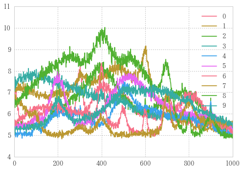


この上にfitting結果を重ねていく

fitting結果resultにapplyする関数を決定する。

横軸の値、縦軸の値を返す関数。


```python
defit = lambda row: (row[1], row[0]+row[3])
```


```python
result.columns
```


    Index(['a', 'mu', 'si', 'nf'], dtype='object')


プロットするときは`mu`が横軸、　`a+nf`が縦軸


```python
plt_pnt = np.apply_along_axis(defit, 1, result); plt_pnt
```


    array([[ 299.80613945,    8.08702471],
           [ 342.17594876,    7.6790899 ],
           [ 247.61852487,    6.53034408],
           [ 301.16637857,    7.21234883],
           [ 231.31230478,    6.04185377],
           [ 324.77737299,    5.46166178],
           [ 288.17570238,    5.8884859 ],
           [ 299.66942789,    5.40802915],
           [ 267.68553009,    8.41734618],
           [ 311.71632169,    5.69015661]])


```python
plt_pnt_se = pd.Series(plt_pnt.T[1], index=plt_pnt.T[0]); plt_pnt_se
```


    299.806139    8.087025
    342.175949    7.679090
    247.618525    6.530344
    301.166379    7.212349
    231.312305    6.041854
    324.777373    5.461662
    288.175702    5.888486
    299.669428    5.408029
    267.685530    8.417346
    311.716322    5.690157
    dtype: float64


```python
df.T.plot(cmap='gray')
plt_pnt_se.plot(style='D', mew=2, fillstyle='none')
```


    <matplotlib.axes._subplots.AxesSubplot at 0x28e0d0400b8>


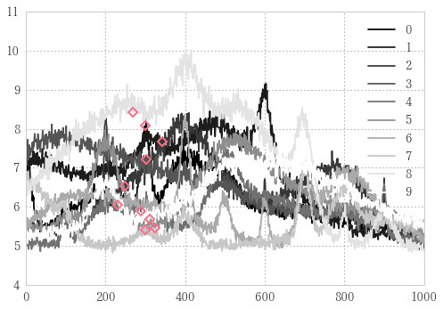


# 特定周波数(axis=1方向)のfittingまとめ

## モジュール


```python
from scipy.optimize import curve_fit
from scipy.stats import scoreatpercentile
r = np.random
```

## 関数

### ガウス関数


```python
def gauss(x, a, mu, si, nf):
    """
    a: 最大値
    mu: 位置
    si: 線幅
    noisef: 最低値
    """
    return a * np.exp(-(x - mu)**2 / 2 / si**2) + nf
```

## パラメータ


```python
param = a, mu, si = 5, 300, 3
```

### フィット関数


```python
def fit(series, a, mu, si):
    """fitting function
    シリーズに対してガウシアンフィッティングを行う
    引数:
        a: 最大値
        mu: 位置
        si: 線幅
    戻り値:
        cf: フィッティング結果(エラーが起きたときはnp.nanのタプル)"""
    errcount = 0
    x, y =  series.index, series.values
    nf = scoreatpercentile(series, 25)
    cfshape = (4,)
    try:
        cf = curve_fit(gauss, x, y, p0=(a, mu, si, nf))
    except Exception as e:
        errcount += 1
        print('error', errcount, ':', e)  # エラー数, エラーメッセージの表示
        cf = np.full(cfshape, np.nan), np.nan  # エラー起きたらnan返す
    return cf
```

### デフィット関数


```python
def defit(row):
    """return fitting result as plot point"""
    return row[1], row[0]+row[3]
```

### choice関数


```python
def choice(array, center, span):↔

```

## データ


```python
def waves(seed: int=np.random.randint(100), rows=10):↔

    df = pd.DataFrame(gauss(xa.T, aa, mua, sia, nf))
    noisedf = df +  0.05 * r.randn(*df.shape)
    return noisedf.sum(1)
```


```python
df = pd.DataFrame([waves(i) for i in range(10)]); df
df.index=pd.date_range('20160101', periods=len(df), freq='H')
```


```python
df.T.plot(legend=False)
# 枠線
w1, w2, h1, h2 = 150, 300, -.5, 4.5
plt.plot((w1,w1, w2, w2, w1), (h1, h2, h2, h1, h1), 'r--')
```


    [<matplotlib.lines.Line2D at 0xc32e940>]


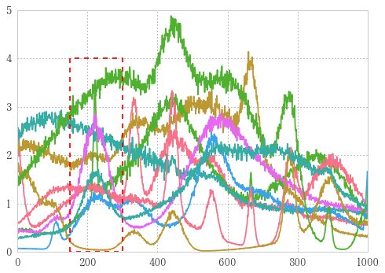


赤枠内をフィッティング

## フィッティング処理


```python
ch = (220, 200)  # 中央値220でスパン200で取り出したい
dfe = df.apply(choice,axis=1, args=ch)  # 抜き出し
fita = dfe.apply(fit, axis=1, args=param)  # フィッティング
    
# フィッティング結果の整理
result = np.array([i[0] for i in fita])  # タプルの第一要素だけを取り出しarray化
plt_pnt = np.apply_along_axis(defit, 1, result)  # ポイントのプロットに必要な部分抜き出し
plt_pnt_se = pd.Series(plt_pnt.T[1], index=plt_pnt.T[0])  # fitting結果をseries化
```

    error 1 : Optimal parameters not found: Number of calls to function has reached maxfev = 1000.
    


```python
result
```


    array([[ -2.66132842e-01,   2.88736148e+02,   9.15963390e+00,
              1.22932384e+00],
           [  6.29053800e-01,   3.11584775e+02,   1.57575658e+01,
              1.90521197e+00],
           [  2.25524792e+00,   2.82022999e+02,   1.16582536e+02,
             -5.87482031e-01],
           [             nan,              nan,              nan,
                         nan],
           [  1.84837107e+00,   2.57369098e+02,   1.19955217e+02,
             -7.69991058e-01],
           [ -1.12784752e+00,   3.09939505e+02,   2.05845982e+01,
              1.69080069e+00],
           [ -2.75390973e-01,   3.04536318e+02,   3.17605280e+01,
              1.35006383e+00],
           [  1.88870239e-01,   3.22392036e+02,   1.21034501e+01,
              1.45666266e-01],
           [  1.14160133e+00,   2.82278675e+02,   8.91448753e+01,
              2.47223875e+00],
           [ -3.80732172e-01,   3.01482594e+02,   1.72303744e+01,
              1.04019927e+00]])


```python
plt_pnt_se
```


     288.736148    0.963191
     311.584775    2.534266
     282.022999    1.667766
    NaN                 NaN
     257.369098    1.078380
     309.939505    0.562953
     304.536318    1.074673
     322.392036    0.334537
     282.278675    3.613840
     301.482594    0.659467
    dtype: float64


```python
fita
```


    2016-01-01 00:00:00    ([-0.266132842286, 288.736147632, 9.1596338973...
    2016-01-01 01:00:00    ([0.629053800282, 311.584774633, 15.7575657574...
    2016-01-01 02:00:00    ([2.25524792039, 282.022999068, 116.582536124,...
    2016-01-01 03:00:00                          ([nan, nan, nan, nan], nan)
    2016-01-01 04:00:00    ([1.84837107258, 257.36909834, 119.95521683, -...
    2016-01-01 05:00:00    ([-1.12784751613, 309.939505307, 20.5845981986...
    2016-01-01 06:00:00    ([-0.275390973387, 304.536318147, 31.760527980...
    2016-01-01 07:00:00    ([0.18887023919, 322.392035815, 12.1034500962,...
    2016-01-01 08:00:00    ([1.14160133394, 282.278675355, 89.1448752819,...
    2016-01-01 09:00:00    ([-0.380732172386, 301.482593897, 17.230374407...
    Freq: H, dtype: object


```python
fita.apply(lambda x: x[0][0])
```


    2016-01-01 00:00:00   -0.266133
    2016-01-01 01:00:00    0.629054
    2016-01-01 02:00:00    2.255248
    2016-01-01 03:00:00         NaN
    2016-01-01 04:00:00    1.848371
    2016-01-01 05:00:00   -1.127848
    2016-01-01 06:00:00   -0.275391
    2016-01-01 07:00:00    0.188870
    2016-01-01 08:00:00    1.141601
    2016-01-01 09:00:00   -0.380732
    Freq: H, dtype: float64


```python
fita.apply(lambda x: x[0][1]+ x[0][3])
```


    2016-01-01 00:00:00    289.965471
    2016-01-01 01:00:00    313.489987
    2016-01-01 02:00:00    281.435517
    2016-01-01 03:00:00           NaN
    2016-01-01 04:00:00    256.599107
    2016-01-01 05:00:00    311.630306
    2016-01-01 06:00:00    305.886382
    2016-01-01 07:00:00    322.537702
    2016-01-01 08:00:00    284.750914
    2016-01-01 09:00:00    302.522793
    Freq: H, dtype: float64


```python
ase = fita.apply(lambda x: x[0][0])
muse = fita.apply(lambda x: x[0][1]+ x[0][3])
amudf = pd.DataFrame([ase, muse]).T
amudf
```


<div>
<table border="1" class="dataframe">
  <thead>
    <tr style="text-align: right;">
      <th></th>
      <th>0</th>
      <th>1</th>
    </tr>
  </thead>
  <tbody>
    <tr>
      <th>2016-01-01 00:00:00</th>
      <td>-0.266133</td>
      <td>289.965471</td>
    </tr>
    <tr>
      <th>2016-01-01 01:00:00</th>
      <td>0.629054</td>
      <td>313.489987</td>
    </tr>
    <tr>
      <th>2016-01-01 02:00:00</th>
      <td>2.255248</td>
      <td>281.435517</td>
    </tr>
    <tr>
      <th>2016-01-01 03:00:00</th>
      <td>NaN</td>
      <td>NaN</td>
    </tr>
    <tr>
      <th>2016-01-01 04:00:00</th>
      <td>1.848371</td>
      <td>256.599107</td>
    </tr>
    <tr>
      <th>2016-01-01 05:00:00</th>
      <td>-1.127848</td>
      <td>311.630306</td>
    </tr>
    <tr>
      <th>2016-01-01 06:00:00</th>
      <td>-0.275391</td>
      <td>305.886382</td>
    </tr>
    <tr>
      <th>2016-01-01 07:00:00</th>
      <td>0.188870</td>
      <td>322.537702</td>
    </tr>
    <tr>
      <th>2016-01-01 08:00:00</th>
      <td>1.141601</td>
      <td>284.750914</td>
    </tr>
    <tr>
      <th>2016-01-01 09:00:00</th>
      <td>-0.380732</td>
      <td>302.522793</td>
    </tr>
  </tbody>
</table>
</div>


```python
fi = a_, mu_, si_, nf_ = result.T; mu_
```


    array([ 288.73614763,  311.58477463,  282.02299907,           nan,
            257.36909834,  309.93950531,  304.53631815,  322.39203582,
            282.27867535,  301.4825939 ])


## フィッティング可視化


```python
df.T.plot(cmap='gray')
plt_pnt_se.plot(style='D', mew=2, fillstyle='none')
```


    <matplotlib.axes._subplots.AxesSubplot at 0xdb94a58>


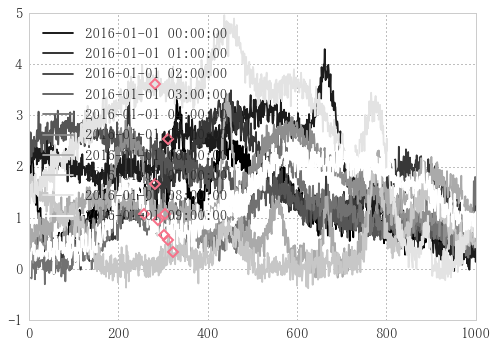


## データフレームへのフィットを関数化

resultさえあれば何とかなるので、resultをreturnする関数にする。


```python
def fit_df(df, center, span):
    param = a, mu, si = df[center].max(), center, 1
    ch = (center, span)  # dfからcenter,spanで取り出す
    dfe = df.apply(choice,axis=1, args=ch)  # 抜き出し
    fita = dfe.apply(fit, axis=1, args=param)  # フィッティング

    # フィッティング結果の整理
    result = np.array([i[0] for i in fita])  # タプルの第一要素だけを取り出しarray化
    return result
```


```python
result = fit_df(df, 220, 200)
result
```


    array([[  2.21691725e-01,   2.13580606e+02,   2.71176423e+01,
              1.12346093e+00],
           [  1.82872764e-01,   2.20590464e+02,   8.88599712e-01,
              1.98918253e+00],
           [  2.08159926e+00,   2.22439925e+02,   4.59234267e+00,
              1.08671082e+00],
           [ -5.75501049e-01,   2.19661573e+02,   2.67285120e-01,
              2.43258836e+00],
           [  1.84757841e+00,   2.57369440e+02,   1.19921676e+02,
             -7.69187238e-01],
           [  2.10001609e+00,   2.23559109e+02,   3.64246222e+01,
              5.40678934e-01],
           [  5.36912197e-01,   2.19109931e+02,  -1.06405484e-01,
              1.27381097e+00],
           [  2.84744125e-01,   2.20155924e+02,  -1.66996800e-01,
              1.56364664e-01],
           [  1.14160092e+00,   2.82278656e+02,   8.91448299e+01,
              2.47223917e+00],
           [  1.12007172e+00,   2.26628421e+02,   3.30471036e+01,
              5.07641118e-01]])


```python
result = fit_df(df, 490, 200)
result
```


    array([[  6.09632590e-01,   4.52668105e+02,   2.48124575e+01,
              1.80484274e+00],
           [  4.77719367e-01,   4.95913415e+02,   1.23812102e+00,
              2.86529818e+00],
           [  1.89850907e+00,   4.39608833e+02,   7.03684270e+01,
              1.20519337e+00],
           [ -5.44771364e+02,   6.12078520e+02,  -5.80921013e+03,
              5.46253682e+02],
           [ -2.04193375e+00,   4.31513618e+02,   6.49819855e+01,
              2.47084422e+00],
           [ -3.80628207e-02,   4.86058973e+02,  -8.13098381e-02,
              1.74054884e+00],
           [ -1.10854882e+00,   5.30669962e+02,   4.00563208e+01,
              1.65257657e+00],
           [ -2.28949421e-01,   4.89262561e+02,  -1.18327723e-01,
              2.71266524e-01],
           [ -1.16329706e-01,   4.88604118e+02,   1.23922372e+00,
              3.95875001e+00],
           [ -1.65863898e+00,   3.88161377e+02,   1.11774843e+02,
              2.62324782e+00]])


```python
plt_pnt = np.apply_along_axis(defit, 1, result)  # ポイントのプロットに必要な部分抜き出し
plt_pnt_se = pd.Series(plt_pnt.T[1], index=plt_pnt.T[0])  # fitting結果をseries化
```

    error 1 : Optimal parameters not found: Number of calls to function has reached maxfev = 1000.
    

___

___


```python
import sys
sys.path.append('../')
```


```python
from fitclass import *
```


```python
# giving initial parameters
mu = Parameter(7)
sigma = Parameter(3)
height = Parameter(5)
```


```python
# define your function:
def f(x, h=height(), mu=mu(), si=sigma()): return h * np.exp(-((x-mu)/si)**2)
```


```python
# fit! (given that data is an array with the data to fit)
data = 10*np.exp(-np.linspace(0, 10, 100)**2) + np.random.rand(100)
fitp, _ = fit(f, [mu, sigma, height], data); fitp
```


    array([ -1.89549379,  12.09140583,  11.17214325])


```python
plt.plot(data)
plt.plot(f(data, *fitp))
```


    [<matplotlib.lines.Line2D at 0xc1785f8>]


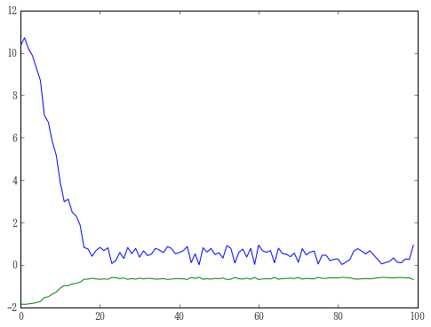


```python

```
