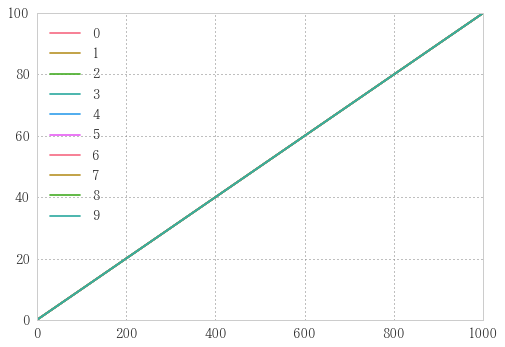
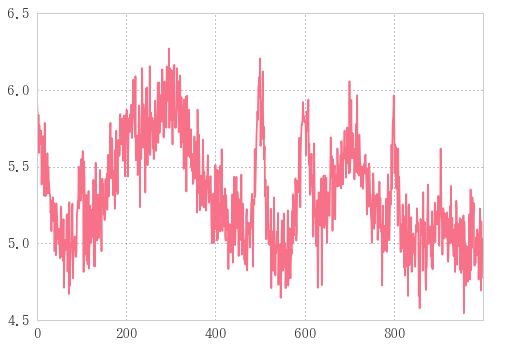
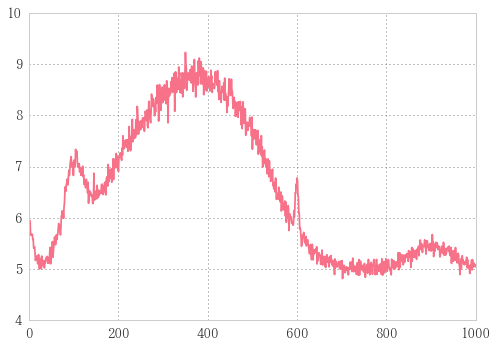

# 自作ガウシアン


```
def gauss(x, a, mu, si, noisef=nf):
    """
    a: 最大値
    mu: 位置
    si: 線幅
    noisef: 最低値
    """
    return a * np.exp(-(x - mu)**2 / 2 / si**2) + noisef
```


```
nf=0.5
n=1001
x = np.linspace(0,100,n)
a, mu, si = 1, 50, 1
```


```
g= gauss(x, a, mu, si); g
```


    array([ 0.5,  0.5,  0.5, ...,  0.5,  0.5,  0.5])


```
plt.plot(x, g)
```


    [<matplotlib.lines.Line2D at 0x148c87bcba8>]


## 自作ガウシアンじゃなくてscipy.stats.normを使うべきでは


```
from  scipy.stats import norm
```


```
z=norm.pdf(x, loc=50, scale=1)-0.5; z
```


    array([-0.5, -0.5, -0.5, ..., -0.5, -0.5, -0.5])


```
plt.plot(x,z)
```


    [<matplotlib.lines.Line2D at 0x148c88209b0>]


```
a, mu, si=1, 50, 1
df=pd.DataFrame({'norm': a*norm.pdf(x, loc=mu, scale=si)+nf,
                 			'gauss': gauss(x, a, mu, si, nf)})
df.plot(style=['-', '--'])
```


    <matplotlib.axes._subplots.AxesSubplot at 0x148c87f5710>


## norm vs my_gauss
normでも自作gaussでも中でnp使っているんで実行速度あんま変わらないだろうとテスト


```
%timeit gauss(x, a, mu, si)
```

    The slowest run took 5.79 times longer than the fastest. This could mean that an intermediate result is being cached.
    10000 loops, best of 3: 59.8 µs per loop
    


```
%timeit norm.pdf(x, loc=50, scale=1)-0.5
```

    The slowest run took 5.26 times longer than the fastest. This could mean that an intermediate result is being cached.
    1000 loops, best of 3: 218 µs per loop
    

自作ガウスのほうが早い…！

## ガウシアンに沿ってノイズを作る

ということで自作のガウシアンを使っていきます。


```
g = gauss(x, a, mu, si)
gnoise = g + 0.1 * np.random.randn(n)
```

ノイズを発生させる


```
plt.plot(x, gnoise, '-')
plt.plot(x, g,'b-' )
```


    [<matplotlib.lines.Line2D at 0x148c883ad68>]


## カーブフィッティングをかけて、ノイズをフィッティングする

gからgnoiseを導き出したのだけれども、ここで急にgを未知の関数とみなしてしまう。
今あなたはgnoiseだけを知っていて、gのような関数を得たいとき、どうするか。

こういう時はカーブフィットを取る。
scipy.optimizeからcurve_fitをインポートしてくる。


```
from scipy.optimize import curve_fit
```

<div class="mark">
次にフィッティングパラメータを定める。</div><i class="fa fa-lightbulb-o "></i>


```
(a_, mu_, si_), _ = curve_fit(gauss, x, gnoise, p0=(a, mu, si))
yfit = gauss(x, a_, mu_, si_)  # フィッティングにより導き出されたa,mu,siを代入
print('元パラメータ:%s\nフィッティングで求めたパラメータ: %s' % ((a, mu , si), (a_, mu_, si_)))
```

    元パラメータ:(1, 50, 1)
    フィッティングで求めたパラメータ: (0.98497122782178148, 49.973664385975219, 0.97612666304535545)
    


```
_
```


    array([[  8.87235438e-04,   4.49809686e-10,  -5.86253148e-04],
           [  4.49809686e-10,   1.16212476e-03,  -4.46876918e-10],
           [ -5.86253148e-04,  -4.46876918e-10,   1.16212476e-03]])


curve_fitの戻り値アンダーバーは共分散？

    pcov : 2d array
    The estimated covariance of popt. The diagonals provide the variance
    of the parameter estimate. To compute one standard deviation errors
    on the parameters use ``perr = np.sqrt(np.diag(pcov))``.


```
plt.plot(x, gnoise, 'r-')
plt.plot(x, yfit, 'b-') 
```


    [<matplotlib.lines.Line2D at 0x148c8933c50>]


さっきと同じグラフに見えるが、描いているのはgではなくyfitであることに注意

同じグラフに見えるということはフィッティングできたということ。

# scipy.stats.normを使った場合

## ガウシアンに沿ってノイズを作る


```
from  scipy.stats import norm
```


```
n=1001
xx = np.linspace(0,100,n)
aa, mu, si = 5, 50, 1
```


```
def gauss2(x, a, mu, si):
    return a*norm.pdf(x, loc=mu, scale=si)-noisef
```


```
g = gauss2(xx, aa, mu, si)
gnoise = g + 0.1 * np.random.randn(n)
```


```
plt.plot(xx, gnoise, '.-')
plt.plot(xx, g,'r-' )
```


    [<matplotlib.lines.Line2D at 0x1ca7b0647f0>]


## カーブフィッティングをかけて、ノイズをフィッティングする

gからgnoiseを導き出したのだけれども、ここで急にgを未知の関数とみなしてしまう。
今あなたはgnoiseだけを知っていて、gのような関数を得たいとき、どうするか。


```
from scipy.optimize import curve_fit
(aa_, mu_, si_), _ = curve_fit(gauss2, xx, gnoise, (aa, mu, si))
yfit = gauss2(xx,aa_, mu_, si_)
```


```
plt.plot(xx, gnoise, '.-')
plt.plot(xx, yfit, 'r-')  # 描いているのはgではなく、yfitであることに注意
```


    [<matplotlib.lines.Line2D at 0x1ca7b1252e8>]


ちゃんとフィッティングできた。

# 自作ガウスをノイズのあるデータフレームにcarve_fitをapply

## ランダムデータフレームの作成


```
r=np.random
```

いっぱい使うから乱数生成をrに縮めちゃう


```
g = gauss(x, a=r.rand(), mu=10*1, si=10*r.rand(), noisef=nf*r.rand())
plt.plot(x, g)
```


    [<matplotlib.lines.Line2D at 0x148cf05d048>]


ランダムな値を使って発生させたガウシアン


```
%%timeit
df = pd.DataFrame([], index=range(1000))
for i in np.arange(min(x), max(x), 10):
    g = gauss(x, a=r.rand(), mu=i, si=10*r.rand(), noisef=nf)
    df[i] = pd.DataFrame(g)
```

    100 loops, best of 3: 9.79 ms per loop
    

まず思いつくforループ


```
# %%timeit
garray = np.array([gauss(x, a=r.rand(), mu=i, si=10*r.rand(), noisef=nf)
for i in np.arange(min(x), max(x), 10)]).T
df = pd.DataFrame(garray)
```

    1000 loops, best of 3: 903 µs per loop
    

より高速


```
df.plot()
```


    <matplotlib.axes._subplots.AxesSubplot at 0x148cf178ac8>





様々な形のガウシアン。

ノイズフロアは一定にした。

こいつらにノイズを載せる。

## ランダムデータフレームにノイズのせてサンプルデータ作成


```
noisedf =df +0.05 * r.randn(*df.shape)
noisedf.plot()
```


    <matplotlib.axes._subplots.AxesSubplot at 0x148d2a4eba8>


5%のノイズをのせた。
`np.randn(*df.shape)`でデータフレームと同じ行列を持ったランダムデータフレームを生成させている。
スターを`df.shape`の前につけてタプルを展開して`randn`に渡す。


```
sumdf = noisedf.sum(axis=1)
sumdf.plot()
```


    <matplotlib.axes._subplots.AxesSubplot at 0x148d2b4c588>





```
sumdf
```


    0      5.787823
    1      5.844201
    2      5.649158
    3      5.858712
    4      5.649082
    5      5.668082
    6      5.721880
    7      5.799648
    8      5.643667
    9      5.843835
    10     5.935265
    11     5.720044
    12     5.537058
    13     5.245885
    14     5.396977
    15     5.686164
    16     5.774004
    17     5.474217
    18     5.496124
    19     5.355029
    20     5.472915
    21     5.758243
    22     5.176296
    23     5.487734
    24     5.199490
    25     5.571278
    26     5.347202
    27     5.515283
    28     5.239639
    29     5.127778
             ...   
    970    4.709422
    971    4.774488
    972    4.734391
    973    4.689422
    974    4.957229
    975    4.956173
    976    5.091661
    977    5.185160
    978    5.149931
    979    4.915803
    980    4.890884
    981    4.914116
    982    4.896102
    983    4.671823
    984    5.210647
    985    4.948862
    986    5.148135
    987    4.834577
    988    4.759693
    989    4.788015
    990    5.038984
    991    4.975161
    992    4.707990
    993    4.899676
    994    4.976002
    995    5.209907
    996    4.702604
    997    4.819293
    998    5.090502
    999    4.725422
    dtype: float64


indexはそのままにカラムをすべて足す。この中でindexいくつの位置にガウシアンが立つかを調べる。

# データフレームに一斉にフィッティングかける
一番やりたかったこと　ここから。


```
param = (a, mu, si) = 5, 300, 3
param
```


    (5, 300, 3)


パラメータ再設定

## 試しに波を一つ選んでfitting


```
def choice(array, center, span):
    """特定の範囲を抜き出す
    引数: 
        array: 抜き出し対象のarrayっぽいの(arraylike)
        center: 抜き出し中央(float)
        span: 抜き出しスパン(float)
    戻り値:
        rarray:
    """
    x1 = int(center - span / 2)
    x2 = int(center + span / 2)
    return array[x1:x2]
```


```
ch = (300, 300)  # 中央値300でスパン300で取り出したい
fitx, fity = choice(sumdf.index, *ch), choice(sumdf, *ch)
plt.plot(fitx, fity)
```


    [<matplotlib.lines.Line2D at 0x148d3f0b908>]





```
popt, pcov = curve_fit(gauss, fitx, fity, p0=param)
print('a, mu, si = ', popt)
```

    a, mu, si =  [   5.33304014  272.51733965  288.27265293]
    

fittingの結果


```
gg = gauss(sumdf.index,*popt)
```


```
sumdf.plot()
plt.plot(fitx, choice(gg, *ch), 'k-')
```


    [<matplotlib.lines.Line2D at 0x148d44ee5c0>]


fittingの結果を用いてガウシアン描いてみる。

___

## 連続的にfitting


```
fit=lambda df: curve_fit(gauss, x[:-1], df['0.0'], p0=(a, mu, si))
```


```
sumdf.apply(fit)
```


    ---------------------------------------------------------------------------

    RuntimeError                              Traceback (most recent call last)

    <ipython-input-231-bded205048ed> in <module>()
    ----> 1 sumdf.apply(fit)
    

    C:\tools\Anaconda3\lib\site-packages\pandas\core\series.py in apply(self, func, convert_dtype, args, **kwds)
       2290             else:
       2291                 values = self.asobject
    -> 2292                 mapped = lib.map_infer(values, f, convert=convert_dtype)
       2293 
       2294         if len(mapped) and isinstance(mapped[0], Series):
    

    pandas\src\inference.pyx in pandas.lib.map_infer (pandas\lib.c:66116)()
    

    <ipython-input-152-76f4b7321d41> in <lambda>(df)
    ----> 1 fit=lambda df: curve_fit(gauss, x[:-1], df, p0=(a, mu, si))
    

    C:\tools\Anaconda3\lib\site-packages\scipy\optimize\minpack.py in curve_fit(f, xdata, ydata, p0, sigma, absolute_sigma, check_finite, bounds, method, jac, **kwargs)
        678         cost = np.sum(infodict['fvec'] ** 2)
        679         if ier not in [1, 2, 3, 4]:
    --> 680             raise RuntimeError("Optimal parameters not found: " + errmsg)
        681     else:
        682         res = least_squares(func, p0, jac=jac, bounds=bounds, method=method,
    

    RuntimeError: Optimal parameters not found: Number of calls to function has reached maxfev = 800.


```

```


```
Bfit = noisedf.T
Bfit.index=pd.date_range('20161111', freq='H', periods=10)
Bfit
```


<div>
<table border="1" class="dataframe">
  <thead>
    <tr style="text-align: right;">
      <th></th>
      <th>0</th>
      <th>1</th>
      <th>2</th>
      <th>3</th>
      <th>4</th>
      <th>5</th>
      <th>6</th>
      <th>7</th>
      <th>8</th>
      <th>9</th>
      <th>...</th>
      <th>990</th>
      <th>991</th>
      <th>992</th>
      <th>993</th>
      <th>994</th>
      <th>995</th>
      <th>996</th>
      <th>997</th>
      <th>998</th>
      <th>999</th>
    </tr>
  </thead>
  <tbody>
    <tr>
      <th>2016-11-11 00:00:00</th>
      <td>1.212010</td>
      <td>1.258258</td>
      <td>1.209776</td>
      <td>1.288453</td>
      <td>1.312047</td>
      <td>1.208359</td>
      <td>1.235260</td>
      <td>1.076348</td>
      <td>1.234967</td>
      <td>1.137405</td>
      <td>...</td>
      <td>0.514774</td>
      <td>0.428211</td>
      <td>0.598484</td>
      <td>0.522549</td>
      <td>0.519271</td>
      <td>0.520157</td>
      <td>0.412700</td>
      <td>0.448095</td>
      <td>0.461003</td>
      <td>0.485658</td>
    </tr>
    <tr>
      <th>2016-11-11 01:00:00</th>
      <td>0.493312</td>
      <td>0.565844</td>
      <td>0.421950</td>
      <td>0.566338</td>
      <td>0.429704</td>
      <td>0.490249</td>
      <td>0.477613</td>
      <td>0.543168</td>
      <td>0.509640</td>
      <td>0.466321</td>
      <td>...</td>
      <td>0.429264</td>
      <td>0.449661</td>
      <td>0.472302</td>
      <td>0.450089</td>
      <td>0.532711</td>
      <td>0.497850</td>
      <td>0.444576</td>
      <td>0.510375</td>
      <td>0.542243</td>
      <td>0.559332</td>
    </tr>
    <tr>
      <th>2016-11-11 02:00:00</th>
      <td>0.617668</td>
      <td>0.504491</td>
      <td>0.506655</td>
      <td>0.629424</td>
      <td>0.459623</td>
      <td>0.550356</td>
      <td>0.552120</td>
      <td>0.517778</td>
      <td>0.474713</td>
      <td>0.492209</td>
      <td>...</td>
      <td>0.459309</td>
      <td>0.579805</td>
      <td>0.506900</td>
      <td>0.461104</td>
      <td>0.452450</td>
      <td>0.535329</td>
      <td>0.465263</td>
      <td>0.535872</td>
      <td>0.549523</td>
      <td>0.442362</td>
    </tr>
    <tr>
      <th>2016-11-11 03:00:00</th>
      <td>0.534732</td>
      <td>0.434818</td>
      <td>0.452569</td>
      <td>0.429995</td>
      <td>0.550611</td>
      <td>0.552787</td>
      <td>0.470041</td>
      <td>0.503814</td>
      <td>0.536437</td>
      <td>0.526805</td>
      <td>...</td>
      <td>0.507729</td>
      <td>0.510552</td>
      <td>0.523317</td>
      <td>0.480549</td>
      <td>0.537138</td>
      <td>0.477658</td>
      <td>0.510539</td>
      <td>0.461372</td>
      <td>0.454722</td>
      <td>0.471645</td>
    </tr>
    <tr>
      <th>2016-11-11 04:00:00</th>
      <td>0.410273</td>
      <td>0.480496</td>
      <td>0.535665</td>
      <td>0.476028</td>
      <td>0.496251</td>
      <td>0.497739</td>
      <td>0.532563</td>
      <td>0.579697</td>
      <td>0.466402</td>
      <td>0.458867</td>
      <td>...</td>
      <td>0.452442</td>
      <td>0.539615</td>
      <td>0.476664</td>
      <td>0.465095</td>
      <td>0.469500</td>
      <td>0.567530</td>
      <td>0.465824</td>
      <td>0.543424</td>
      <td>0.524870</td>
      <td>0.597768</td>
    </tr>
    <tr>
      <th>2016-11-11 05:00:00</th>
      <td>0.504844</td>
      <td>0.585218</td>
      <td>0.436708</td>
      <td>0.510879</td>
      <td>0.534301</td>
      <td>0.533283</td>
      <td>0.486974</td>
      <td>0.505978</td>
      <td>0.457899</td>
      <td>0.416528</td>
      <td>...</td>
      <td>0.512470</td>
      <td>0.516137</td>
      <td>0.471788</td>
      <td>0.485482</td>
      <td>0.477160</td>
      <td>0.424786</td>
      <td>0.461915</td>
      <td>0.421985</td>
      <td>0.521713</td>
      <td>0.534520</td>
    </tr>
    <tr>
      <th>2016-11-11 06:00:00</th>
      <td>0.417943</td>
      <td>0.510378</td>
      <td>0.561102</td>
      <td>0.473348</td>
      <td>0.547520</td>
      <td>0.501062</td>
      <td>0.538977</td>
      <td>0.506837</td>
      <td>0.576644</td>
      <td>0.429382</td>
      <td>...</td>
      <td>0.538923</td>
      <td>0.543066</td>
      <td>0.634124</td>
      <td>0.437527</td>
      <td>0.546653</td>
      <td>0.428585</td>
      <td>0.503116</td>
      <td>0.488980</td>
      <td>0.513469</td>
      <td>0.465994</td>
    </tr>
    <tr>
      <th>2016-11-11 07:00:00</th>
      <td>0.456581</td>
      <td>0.578147</td>
      <td>0.534539</td>
      <td>0.437597</td>
      <td>0.494838</td>
      <td>0.445275</td>
      <td>0.459347</td>
      <td>0.466767</td>
      <td>0.550208</td>
      <td>0.408358</td>
      <td>...</td>
      <td>0.596552</td>
      <td>0.572876</td>
      <td>0.421376</td>
      <td>0.626990</td>
      <td>0.540775</td>
      <td>0.502943</td>
      <td>0.534820</td>
      <td>0.420050</td>
      <td>0.515703</td>
      <td>0.511490</td>
    </tr>
    <tr>
      <th>2016-11-11 08:00:00</th>
      <td>0.487674</td>
      <td>0.527124</td>
      <td>0.462124</td>
      <td>0.519189</td>
      <td>0.478155</td>
      <td>0.535298</td>
      <td>0.458398</td>
      <td>0.579006</td>
      <td>0.470864</td>
      <td>0.533235</td>
      <td>...</td>
      <td>0.572156</td>
      <td>0.622233</td>
      <td>0.477770</td>
      <td>0.568988</td>
      <td>0.541956</td>
      <td>0.573163</td>
      <td>0.493426</td>
      <td>0.543387</td>
      <td>0.540880</td>
      <td>0.535761</td>
    </tr>
    <tr>
      <th>2016-11-11 09:00:00</th>
      <td>0.499399</td>
      <td>0.443160</td>
      <td>0.370964</td>
      <td>0.410643</td>
      <td>0.460746</td>
      <td>0.571716</td>
      <td>0.487904</td>
      <td>0.524689</td>
      <td>0.585601</td>
      <td>0.635540</td>
      <td>...</td>
      <td>0.421390</td>
      <td>0.476703</td>
      <td>0.492336</td>
      <td>0.474076</td>
      <td>0.417654</td>
      <td>0.580822</td>
      <td>0.522962</td>
      <td>0.434270</td>
      <td>0.505289</td>
      <td>0.437671</td>
    </tr>
  </tbody>
</table>
<p>10 rows × 1000 columns</p>
</div>


実際fittingかけたいデータフレームはindexが時間、カラムが
