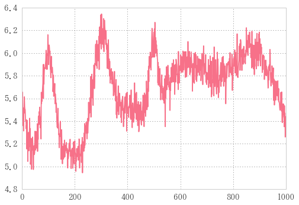
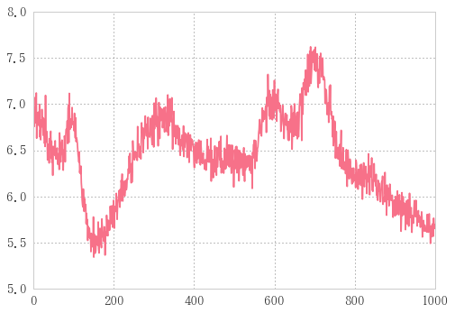

# 自作ガウシアン


```python
def gauss(x, a, mu, si, noisef):
    """
    a: 最大値
    mu: 位置
    si: 線幅
    noisef: 最低値
    """
    return a * np.exp(-(x - mu)**2 / 2 / si**2) + noisef
```


```python
nf=0.5
n=1001
x = np.linspace(0,100,n)
a, mu, si = 1, 50, 1
```


```python
g= gauss(x, a, mu, si, nf); g
```


    array([ 0.5,  0.5,  0.5, ...,  0.5,  0.5,  0.5])


```python
plt.plot(x, g)
```


    [<matplotlib.lines.Line2D at 0x1de4319fb70>]


## 自作ガウシアンじゃなくてscipy.stats.normを使うべきでは


```python
from  scipy.stats import norm
```


```python
z=norm.pdf(x, loc=50, scale=1)-0.5; z
```


    array([-0.5, -0.5, -0.5, ..., -0.5, -0.5, -0.5])


```python
plt.plot(x,z)
```


    [<matplotlib.lines.Line2D at 0x148c88209b0>]


```python
a, mu, si=1, 50, 1
df=pd.DataFrame({'norm': a*norm.pdf(x, loc=mu, scale=si)+nf,
                 			'gauss': gauss(x, a, mu, si, nf)})
df.plot(style=['-', '--'])
```


    <matplotlib.axes._subplots.AxesSubplot at 0x148c87f5710>


## norm vs my_gauss
normでも自作gaussでも中でnp使っているんで実行速度あんま変わらないだろうとテスト


```python
%timeit gauss(x, a, mu, si)
```

    The slowest run took 5.79 times longer than the fastest. This could mean that an intermediate result is being cached.
    10000 loops, best of 3: 59.8 µs per loop
    


```python
%timeit norm.pdf(x, loc=50, scale=1)-0.5
```

    The slowest run took 5.26 times longer than the fastest. This could mean that an intermediate result is being cached.
    1000 loops, best of 3: 218 µs per loop
    

自作ガウスのほうが早い…！

## ガウシアンに沿ってノイズを作る

ということで自作のガウシアンを使っていきます。


```python
g = gauss(x, a, mu, si)
gnoise = g + 0.1 * np.random.randn(n)
```

ノイズを発生させる


```python
plt.plot(x, gnoise, '-')
plt.plot(x, g,'b-' )
```


    [<matplotlib.lines.Line2D at 0x148c883ad68>]


## カーブフィッティングをかけて、ノイズをフィッティングする

gからgnoiseを導き出したのだけれども、ここで急にgを未知の関数とみなしてしまう。
今あなたはgnoiseだけを知っていて、gのような関数を得たいとき、どうするか。

こういう時はカーブフィットを取る。
scipy.optimizeからcurve_fitをインポートしてくる。


```python
from scipy.optimize import curve_fit
```

<div class="mark">
次にフィッティングパラメータを定める。</div><i class="fa fa-lightbulb-o "></i>


```python
(a_, mu_, si_), _ = curve_fit(gauss, x, gnoise, p0=(a, mu, si))
yfit = gauss(x, a_, mu_, si_)  # フィッティングにより導き出されたa,mu,siを代入
print('元パラメータ:%s\nフィッティングで求めたパラメータ: %s' % ((a, mu , si), (a_, mu_, si_)))
```

    元パラメータ:(1, 50, 1)
    フィッティングで求めたパラメータ: (0.98497122782178148, 49.973664385975219, 0.97612666304535545)
    


```python
_
```


    array([[  8.87235438e-04,   4.49809686e-10,  -5.86253148e-04],
           [  4.49809686e-10,   1.16212476e-03,  -4.46876918e-10],
           [ -5.86253148e-04,  -4.46876918e-10,   1.16212476e-03]])


curve_fitの戻り値アンダーバーは共分散？

    pcov : 2d array
    The estimated covariance of popt. The diagonals provide the variance
    of the parameter estimate. To compute one standard deviation errors
    on the parameters use ``perr = np.sqrt(np.diag(pcov))``.


```python
plt.plot(x, gnoise, 'r-')
plt.plot(x, yfit, 'b-') 
```


    [<matplotlib.lines.Line2D at 0x148c8933c50>]


さっきと同じグラフに見えるが、描いているのはgではなくyfitであることに注意

同じグラフに見えるということはフィッティングできたということ。

# scipy.stats.normを使った場合

## ガウシアンに沿ってノイズを作る


```python
from  scipy.stats import norm
```


```python
n=1001
xx = np.linspace(0,100,n)
aa, mu, si = 5, 50, 1
```


```python
def gauss2(x, a, mu, si):
    return a*norm.pdf(x, loc=mu, scale=si)-noisef
```


```python
g = gauss2(xx, aa, mu, si)
gnoise = g + 0.1 * np.random.randn(n)
```


```python
plt.plot(xx, gnoise, '.-')
plt.plot(xx, g,'r-' )
```


    [<matplotlib.lines.Line2D at 0x1ca7b0647f0>]


## カーブフィッティングをかけて、ノイズをフィッティングする

gからgnoiseを導き出したのだけれども、ここで急にgを未知の関数とみなしてしまう。
今あなたはgnoiseだけを知っていて、gのような関数を得たいとき、どうするか。


```python
from scipy.optimize import curve_fit
(aa_, mu_, si_), _ = curve_fit(gauss2, xx, gnoise, (aa, mu, si))
yfit = gauss2(xx,aa_, mu_, si_)
```


```python
plt.plot(xx, gnoise, '.-')
plt.plot(xx, yfit, 'r-')  # 描いているのはgではなく、yfitであることに注意
```


    [<matplotlib.lines.Line2D at 0x1ca7b1252e8>]


ちゃんとフィッティングできた。

# 自作ガウスをノイズのあるデータフレームにcarve_fitをapply

## ランダムデータフレームの作成


```python
r=np.random
```

いっぱい使うから乱数生成をrに縮めちゃう


```python
g = gauss(x, a=r.rand(), mu=10*1, si=10*r.rand(), noisef=nf*r.rand())
plt.plot(x, g)
```


    [<matplotlib.lines.Line2D at 0x1de436ccfd0>]


ランダムな値を使って発生させたガウシアン


```python
%%timeit
df = pd.DataFrame([], index=range(1000))
for i in np.arange(min(x), max(x), 10):
    g = gauss(x, a=r.rand(), mu=i, si=10*r.rand(), noisef=nf)
    df[i] = pd.DataFrame(g)
```

    100 loops, best of 3: 8.69 ms per loop
    

まず思いつくforループ


```python
%%timeit
garray = np.array([gauss(x, a=r.rand(), mu=i, si=10*r.rand(), noisef=nf)
                    for i in np.arange(min(x), max(x), 10)]).T
df = pd.DataFrame(garray)
```

    1000 loops, best of 3: 743 µs per loop
    

リスト内包表記を使うことでより高速


```python
%%timeit
xa = np.tile(x, (10,1))
aa = abs(r.randn(10))
mua = np.arange(min(x), max(x), 10)
sia = 10 * abs(r.randn(10))

df = pd.DataFrame(gauss(xa.T, aa, mua, sia, nf))
```

    1000 loops, best of 3: 693 µs per loop
    

np.arrayで変数作るともっともっと高速


```python
gdf.plot()
```


    <matplotlib.axes._subplots.AxesSubplot at 0x1de4b011c18>


## 足し合わせた複数の波があるdf

様々な形のガウシアン。

ノイズフロアは一定にした。

こいつらにノイズを載せる。

## ランダムデータフレームにノイズのせてサンプルデータ作成


```python
noisedf =df + df * 0.05 * r.randn(*df.shape)
noisedf.plot()
```


    <matplotlib.axes._subplots.AxesSubplot at 0x1de4c37d320>


5%のノイズをのせた。
`np.randn(*df.shape)`でデータフレームと同じ行列を持ったランダムデータフレームを生成させている。
スターを`df.shape`の前につけてタプルを展開して`randn`に渡す。


```python
sumdf = noisedf.sum(axis=1)
sumdf.plot()
```


    <matplotlib.axes._subplots.AxesSubplot at 0x1de4c436320>





```python
sumdf
```


    0       5.432676
    1       5.605698
    2       5.298539
    3       5.522210
    4       5.598536
    5       5.628876
    6       5.590488
    7       5.520159
    8       5.357040
    9       5.524325
    10      5.352305
    11      5.252700
    12      5.442083
    13      5.357631
    14      5.633205
    15      5.394023
    16      5.485547
    17      5.300434
    18      5.472389
    19      5.403377
    20      4.983068
    21      5.330210
    22      5.274541
    23      5.166913
    24      5.551668
    25      5.476331
    26      5.108893
    27      4.984221
    28      5.214877
    29      5.402299
              ...   
    971     5.363341
    972     5.478791
    973     5.665920
    974     5.777761
    975     5.737976
    976     5.659097
    977     5.625246
    978     5.545209
    979     5.726983
    980     5.747878
    981     5.479815
    982     5.714544
    983     5.406541
    984     5.325538
    985     5.532115
    986     5.222370
    987     5.502674
    988     5.481744
    989     5.548988
    990     5.690841
    991     5.502521
    992     5.599736
    993     5.366537
    994     5.508551
    995     5.497639
    996     5.128502
    997     5.403535
    998     5.350118
    999     5.540160
    1000    5.401792
    dtype: float64


indexはそのままにカラムをすべて足す。この中でindexいくつの位置にガウシアンが立つかを調べる。

## 複数のランダムウェーブを生成


```python
def waves(seed: int=np.random.randint(100)):
    """ランダムノイズを発生させたウェーブを作成する
    引数: seed: ランダムステートを初期化する整数。デフォルトでseedをランダムに発生させる
    戻り値: noisedf.sum(1): pd.Series型"""
    r = np.random
    r.seed(seed)  # ランダム初期化
    xa = np.tile(x, (10,1))
    aa = abs(r.randn(10))
    mua = np.arange(min(x), max(x), 10)
    sia = 10 * abs(r.randn(10))

    df = pd.DataFrame(gauss(xa.T, aa, mua, sia, nf))
    noisedf = df + df * 0.05 * r.randn(*df.shape)
    return noisedf.sum(1)
waves().plot()
```


    <matplotlib.axes._subplots.AxesSubplot at 0x1de4eae4400>





```python
%timeit waves()
```

    100 loops, best of 3: 2.33 ms per loop
    


```python
pd.DataFrame([waves(i) for i in range(10)])
```


<div>
<table border="1" class="dataframe">
  <thead>
    <tr style="text-align: right;">
      <th></th>
      <th>0</th>
      <th>1</th>
      <th>2</th>
      <th>3</th>
      <th>4</th>
      <th>5</th>
      <th>6</th>
      <th>7</th>
      <th>8</th>
      <th>9</th>
      <th>...</th>
      <th>991</th>
      <th>992</th>
      <th>993</th>
      <th>994</th>
      <th>995</th>
      <th>996</th>
      <th>997</th>
      <th>998</th>
      <th>999</th>
      <th>1000</th>
    </tr>
  </thead>
  <tbody>
    <tr>
      <th>0</th>
      <td>6.945187</td>
      <td>7.108197</td>
      <td>6.845565</td>
      <td>6.948541</td>
      <td>6.845199</td>
      <td>7.055347</td>
      <td>6.977616</td>
      <td>7.056927</td>
      <td>7.079365</td>
      <td>7.138362</td>
      <td>...</td>
      <td>5.352165</td>
      <td>5.237588</td>
      <td>5.368697</td>
      <td>5.147199</td>
      <td>5.197124</td>
      <td>5.213663</td>
      <td>5.317618</td>
      <td>5.263670</td>
      <td>5.266836</td>
      <td>5.319199</td>
    </tr>
    <tr>
      <th>1</th>
      <td>7.133442</td>
      <td>7.059512</td>
      <td>7.190294</td>
      <td>7.232617</td>
      <td>7.261932</td>
      <td>7.016845</td>
      <td>7.189088</td>
      <td>7.295845</td>
      <td>7.185489</td>
      <td>7.022073</td>
      <td>...</td>
      <td>5.166897</td>
      <td>5.017208</td>
      <td>5.075220</td>
      <td>5.214620</td>
      <td>5.136346</td>
      <td>5.049252</td>
      <td>5.014033</td>
      <td>5.049660</td>
      <td>5.022505</td>
      <td>5.217068</td>
    </tr>
    <tr>
      <th>2</th>
      <td>5.348248</td>
      <td>5.553449</td>
      <td>5.548598</td>
      <td>5.538164</td>
      <td>5.430301</td>
      <td>5.412686</td>
      <td>5.579073</td>
      <td>5.552572</td>
      <td>5.647116</td>
      <td>5.415833</td>
      <td>...</td>
      <td>5.104680</td>
      <td>5.207193</td>
      <td>5.014641</td>
      <td>5.061536</td>
      <td>5.125885</td>
      <td>5.072221</td>
      <td>5.181555</td>
      <td>4.908350</td>
      <td>5.057412</td>
      <td>5.102178</td>
    </tr>
    <tr>
      <th>3</th>
      <td>7.274488</td>
      <td>7.426611</td>
      <td>7.076638</td>
      <td>7.595002</td>
      <td>7.723684</td>
      <td>7.506426</td>
      <td>7.210183</td>
      <td>7.406186</td>
      <td>7.584276</td>
      <td>7.486866</td>
      <td>...</td>
      <td>5.332370</td>
      <td>5.272767</td>
      <td>5.421780</td>
      <td>5.499642</td>
      <td>5.210076</td>
      <td>5.363444</td>
      <td>5.385211</td>
      <td>5.220253</td>
      <td>5.466960</td>
      <td>5.286162</td>
    </tr>
    <tr>
      <th>4</th>
      <td>5.086649</td>
      <td>5.070892</td>
      <td>5.054293</td>
      <td>5.011917</td>
      <td>5.164769</td>
      <td>5.146161</td>
      <td>4.921866</td>
      <td>5.057269</td>
      <td>5.123093</td>
      <td>5.084757</td>
      <td>...</td>
      <td>5.065826</td>
      <td>5.150936</td>
      <td>5.078083</td>
      <td>5.028696</td>
      <td>5.064742</td>
      <td>5.037380</td>
      <td>5.331177</td>
      <td>5.131369</td>
      <td>5.206482</td>
      <td>5.235898</td>
    </tr>
    <tr>
      <th>5</th>
      <td>5.380750</td>
      <td>5.546886</td>
      <td>5.502097</td>
      <td>5.557626</td>
      <td>5.416009</td>
      <td>5.364240</td>
      <td>5.585252</td>
      <td>5.475956</td>
      <td>5.528495</td>
      <td>5.392496</td>
      <td>...</td>
      <td>5.354433</td>
      <td>5.439949</td>
      <td>5.550969</td>
      <td>5.281462</td>
      <td>5.491426</td>
      <td>5.382127</td>
      <td>5.453180</td>
      <td>5.208387</td>
      <td>5.277590</td>
      <td>5.423068</td>
    </tr>
    <tr>
      <th>6</th>
      <td>5.629440</td>
      <td>5.443759</td>
      <td>5.531657</td>
      <td>5.720805</td>
      <td>5.500641</td>
      <td>5.665483</td>
      <td>5.582582</td>
      <td>5.677595</td>
      <td>5.435612</td>
      <td>5.648220</td>
      <td>...</td>
      <td>5.288703</td>
      <td>5.109035</td>
      <td>5.229636</td>
      <td>5.267676</td>
      <td>5.134689</td>
      <td>5.277698</td>
      <td>5.236259</td>
      <td>5.066652</td>
      <td>5.206823</td>
      <td>5.181833</td>
    </tr>
    <tr>
      <th>7</th>
      <td>6.827328</td>
      <td>6.582126</td>
      <td>6.744212</td>
      <td>6.905696</td>
      <td>6.514176</td>
      <td>6.890059</td>
      <td>6.824137</td>
      <td>6.794166</td>
      <td>6.634765</td>
      <td>6.680948</td>
      <td>...</td>
      <td>5.532310</td>
      <td>5.495926</td>
      <td>5.500994</td>
      <td>5.431254</td>
      <td>5.448915</td>
      <td>5.520323</td>
      <td>5.463009</td>
      <td>5.670345</td>
      <td>5.523788</td>
      <td>5.370447</td>
    </tr>
    <tr>
      <th>8</th>
      <td>6.417707</td>
      <td>6.429011</td>
      <td>6.475284</td>
      <td>6.290368</td>
      <td>6.670582</td>
      <td>6.636257</td>
      <td>6.427363</td>
      <td>6.455692</td>
      <td>6.620168</td>
      <td>6.508548</td>
      <td>...</td>
      <td>4.998059</td>
      <td>4.907901</td>
      <td>4.900991</td>
      <td>4.984814</td>
      <td>5.011483</td>
      <td>4.939173</td>
      <td>5.053548</td>
      <td>4.868739</td>
      <td>4.874232</td>
      <td>4.905128</td>
    </tr>
    <tr>
      <th>9</th>
      <td>5.285603</td>
      <td>5.404935</td>
      <td>5.279550</td>
      <td>5.060339</td>
      <td>5.276347</td>
      <td>5.236848</td>
      <td>5.305694</td>
      <td>5.347108</td>
      <td>5.337980</td>
      <td>5.361805</td>
      <td>...</td>
      <td>5.626433</td>
      <td>5.572625</td>
      <td>5.647371</td>
      <td>5.480810</td>
      <td>5.495603</td>
      <td>5.535284</td>
      <td>5.492852</td>
      <td>5.550408</td>
      <td>5.592165</td>
      <td>5.344825</td>
    </tr>
  </tbody>
</table>
<p>10 rows × 1001 columns</p>
</div>


# データフレームに一斉にフィッティングかける
一番やりたかったこと　ここから。


```python
param = (a, mu, si) = 5, 300, 3
param
```


    (5, 300, 3)


パラメータ再設定

## 試しに波を一つ選んでfitting


```python
def choice(array, center, span):
    """特定の範囲を抜き出す
    引数: 
        array: 抜き出し対象のarrayっぽいの(arraylike)
        center: 抜き出し中央(float)
        span: 抜き出しスパン(float)
    戻り値:
        rarray:
    """
    x1 = int(center - span / 2)
    x2 = int(center + span / 2)
    return array[x1:x2]
```


```python
ch = (300, 300)  # 中央値300でスパン300で取り出したい
fitx, fity = choice(sumdf.index, *ch), choice(sumdf, *ch)
plt.plot(fitx, fity)
```


    [<matplotlib.lines.Line2D at 0x148d3f0b908>]


```python
popt, _pcov = curve_fit(gauss, fitx, fity, p0=param)
print('a, mu, si = ', popt)
```

    a, mu, si =  [   5.33304014  272.51733965  288.27265293]
    

fittingの結果


```python
gg = gauss(sumdf.index,*popt)
```


```python
sumdf.plot()
plt.plot(fitx, choice(gg, *ch), 'k-')
```


    [<matplotlib.lines.Line2D at 0x148d44ee5c0>]


fittingの結果を用いてガウシアン描いてみる。

## 連続的にfitting


```python
fitting_list = (300, 500, 600, 700)  # 目測どのあたりに波があるか
fitdf=pd.DataFrame(np.empty(1000))
for i in fitting_list:
    param = (a, mu, si) = 5, i, 3
    ch = (i, 300)
    fitx, fity = choice(sumdf.index, *ch), choice(sumdf, *ch)
    popt, _pcov = curve_fit(gauss, fitx, fity, p0=param, maxfev = 10000)
    gg = gauss(sumdf.index,*popt)
    fitdf[i] = pd.DataFrame(choice(gg, *ch), index=fitx)
del fitdf[0]
```


```python
fitdf['sumdf'] = sumdf
fitdf.plot(style = ['-', '-', '-', '-', '.'])
```


    <matplotlib.axes._subplots.AxesSubplot at 0x148d6b39518>


```python
fit=lambda df: curve_fit(gauss, x[:-1], df['0.0'], p0=(a, mu, si))
```


```python
sumdf.apply(fit)
```


    ---------------------------------------------------------------------------

    RuntimeError                              Traceback (most recent call last)

    <ipython-input-231-bded205048ed> in <module>()
    ----> 1 sumdf.apply(fit)
    

    C:\tools\Anaconda3\lib\site-packages\pandas\core\series.py in apply(self, func, convert_dtype, args, **kwds)
       2290             else:
       2291                 values = self.asobject
    -> 2292                 mapped = lib.map_infer(values, f, convert=convert_dtype)
       2293 
       2294         if len(mapped) and isinstance(mapped[0], Series):
    

    pandas\src\inference.pyx in pandas.lib.map_infer (pandas\lib.c:66116)()
    

    <ipython-input-152-76f4b7321d41> in <lambda>(df)
    ----> 1 fit=lambda df: curve_fit(gauss, x[:-1], df, p0=(a, mu, si))
    

    C:\tools\Anaconda3\lib\site-packages\scipy\optimize\minpack.py in curve_fit(f, xdata, ydata, p0, sigma, absolute_sigma, check_finite, bounds, method, jac, **kwargs)
        678         cost = np.sum(infodict['fvec'] ** 2)
        679         if ier not in [1, 2, 3, 4]:
    --> 680             raise RuntimeError("Optimal parameters not found: " + errmsg)
        681     else:
        682         res = least_squares(func, p0, jac=jac, bounds=bounds, method=method,
    

    RuntimeError: Optimal parameters not found: Number of calls to function has reached maxfev = 800.


```python

```


```python
Bfit = noisedf.T
Bfit.index=pd.date_range('20161111', freq='H', periods=10)
Bfit
```


<div>
<table border="1" class="dataframe">
  <thead>
    <tr style="text-align: right;">
      <th></th>
      <th>0</th>
      <th>1</th>
      <th>2</th>
      <th>3</th>
      <th>4</th>
      <th>5</th>
      <th>6</th>
      <th>7</th>
      <th>8</th>
      <th>9</th>
      <th>...</th>
      <th>990</th>
      <th>991</th>
      <th>992</th>
      <th>993</th>
      <th>994</th>
      <th>995</th>
      <th>996</th>
      <th>997</th>
      <th>998</th>
      <th>999</th>
    </tr>
  </thead>
  <tbody>
    <tr>
      <th>2016-11-11 00:00:00</th>
      <td>1.212010</td>
      <td>1.258258</td>
      <td>1.209776</td>
      <td>1.288453</td>
      <td>1.312047</td>
      <td>1.208359</td>
      <td>1.235260</td>
      <td>1.076348</td>
      <td>1.234967</td>
      <td>1.137405</td>
      <td>...</td>
      <td>0.514774</td>
      <td>0.428211</td>
      <td>0.598484</td>
      <td>0.522549</td>
      <td>0.519271</td>
      <td>0.520157</td>
      <td>0.412700</td>
      <td>0.448095</td>
      <td>0.461003</td>
      <td>0.485658</td>
    </tr>
    <tr>
      <th>2016-11-11 01:00:00</th>
      <td>0.493312</td>
      <td>0.565844</td>
      <td>0.421950</td>
      <td>0.566338</td>
      <td>0.429704</td>
      <td>0.490249</td>
      <td>0.477613</td>
      <td>0.543168</td>
      <td>0.509640</td>
      <td>0.466321</td>
      <td>...</td>
      <td>0.429264</td>
      <td>0.449661</td>
      <td>0.472302</td>
      <td>0.450089</td>
      <td>0.532711</td>
      <td>0.497850</td>
      <td>0.444576</td>
      <td>0.510375</td>
      <td>0.542243</td>
      <td>0.559332</td>
    </tr>
    <tr>
      <th>2016-11-11 02:00:00</th>
      <td>0.617668</td>
      <td>0.504491</td>
      <td>0.506655</td>
      <td>0.629424</td>
      <td>0.459623</td>
      <td>0.550356</td>
      <td>0.552120</td>
      <td>0.517778</td>
      <td>0.474713</td>
      <td>0.492209</td>
      <td>...</td>
      <td>0.459309</td>
      <td>0.579805</td>
      <td>0.506900</td>
      <td>0.461104</td>
      <td>0.452450</td>
      <td>0.535329</td>
      <td>0.465263</td>
      <td>0.535872</td>
      <td>0.549523</td>
      <td>0.442362</td>
    </tr>
    <tr>
      <th>2016-11-11 03:00:00</th>
      <td>0.534732</td>
      <td>0.434818</td>
      <td>0.452569</td>
      <td>0.429995</td>
      <td>0.550611</td>
      <td>0.552787</td>
      <td>0.470041</td>
      <td>0.503814</td>
      <td>0.536437</td>
      <td>0.526805</td>
      <td>...</td>
      <td>0.507729</td>
      <td>0.510552</td>
      <td>0.523317</td>
      <td>0.480549</td>
      <td>0.537138</td>
      <td>0.477658</td>
      <td>0.510539</td>
      <td>0.461372</td>
      <td>0.454722</td>
      <td>0.471645</td>
    </tr>
    <tr>
      <th>2016-11-11 04:00:00</th>
      <td>0.410273</td>
      <td>0.480496</td>
      <td>0.535665</td>
      <td>0.476028</td>
      <td>0.496251</td>
      <td>0.497739</td>
      <td>0.532563</td>
      <td>0.579697</td>
      <td>0.466402</td>
      <td>0.458867</td>
      <td>...</td>
      <td>0.452442</td>
      <td>0.539615</td>
      <td>0.476664</td>
      <td>0.465095</td>
      <td>0.469500</td>
      <td>0.567530</td>
      <td>0.465824</td>
      <td>0.543424</td>
      <td>0.524870</td>
      <td>0.597768</td>
    </tr>
    <tr>
      <th>2016-11-11 05:00:00</th>
      <td>0.504844</td>
      <td>0.585218</td>
      <td>0.436708</td>
      <td>0.510879</td>
      <td>0.534301</td>
      <td>0.533283</td>
      <td>0.486974</td>
      <td>0.505978</td>
      <td>0.457899</td>
      <td>0.416528</td>
      <td>...</td>
      <td>0.512470</td>
      <td>0.516137</td>
      <td>0.471788</td>
      <td>0.485482</td>
      <td>0.477160</td>
      <td>0.424786</td>
      <td>0.461915</td>
      <td>0.421985</td>
      <td>0.521713</td>
      <td>0.534520</td>
    </tr>
    <tr>
      <th>2016-11-11 06:00:00</th>
      <td>0.417943</td>
      <td>0.510378</td>
      <td>0.561102</td>
      <td>0.473348</td>
      <td>0.547520</td>
      <td>0.501062</td>
      <td>0.538977</td>
      <td>0.506837</td>
      <td>0.576644</td>
      <td>0.429382</td>
      <td>...</td>
      <td>0.538923</td>
      <td>0.543066</td>
      <td>0.634124</td>
      <td>0.437527</td>
      <td>0.546653</td>
      <td>0.428585</td>
      <td>0.503116</td>
      <td>0.488980</td>
      <td>0.513469</td>
      <td>0.465994</td>
    </tr>
    <tr>
      <th>2016-11-11 07:00:00</th>
      <td>0.456581</td>
      <td>0.578147</td>
      <td>0.534539</td>
      <td>0.437597</td>
      <td>0.494838</td>
      <td>0.445275</td>
      <td>0.459347</td>
      <td>0.466767</td>
      <td>0.550208</td>
      <td>0.408358</td>
      <td>...</td>
      <td>0.596552</td>
      <td>0.572876</td>
      <td>0.421376</td>
      <td>0.626990</td>
      <td>0.540775</td>
      <td>0.502943</td>
      <td>0.534820</td>
      <td>0.420050</td>
      <td>0.515703</td>
      <td>0.511490</td>
    </tr>
    <tr>
      <th>2016-11-11 08:00:00</th>
      <td>0.487674</td>
      <td>0.527124</td>
      <td>0.462124</td>
      <td>0.519189</td>
      <td>0.478155</td>
      <td>0.535298</td>
      <td>0.458398</td>
      <td>0.579006</td>
      <td>0.470864</td>
      <td>0.533235</td>
      <td>...</td>
      <td>0.572156</td>
      <td>0.622233</td>
      <td>0.477770</td>
      <td>0.568988</td>
      <td>0.541956</td>
      <td>0.573163</td>
      <td>0.493426</td>
      <td>0.543387</td>
      <td>0.540880</td>
      <td>0.535761</td>
    </tr>
    <tr>
      <th>2016-11-11 09:00:00</th>
      <td>0.499399</td>
      <td>0.443160</td>
      <td>0.370964</td>
      <td>0.410643</td>
      <td>0.460746</td>
      <td>0.571716</td>
      <td>0.487904</td>
      <td>0.524689</td>
      <td>0.585601</td>
      <td>0.635540</td>
      <td>...</td>
      <td>0.421390</td>
      <td>0.476703</td>
      <td>0.492336</td>
      <td>0.474076</td>
      <td>0.417654</td>
      <td>0.580822</td>
      <td>0.522962</td>
      <td>0.434270</td>
      <td>0.505289</td>
      <td>0.437671</td>
    </tr>
  </tbody>
</table>
<p>10 rows × 1000 columns</p>
</div>


実際fittingかけたいデータフレームはindexが時間、カラムが

___


```python
import sys
sys.path.append('../')
```


```python
from fitclass import *
```


```python
# giving initial parameters
mu = Parameter(7)
sigma = Parameter(3)
height = Parameter(5)
```


```python
# define your function:
def f(x, h=height(), mu=mu(), si=sigma()): return h * np.exp(-((x-mu)/si)**2)
```


```python
# fit! (given that data is an array with the data to fit)
data = 10*np.exp(-np.linspace(0, 10, 100)**2) + np.random.rand(100)
fitp, _ = fit(f, [mu, sigma, height], data); fitp
```


    array([ -1.89549379,  12.09140583,  11.17214325])


```python
plt.plot(data)
plt.plot(f(data, *fitp))
```


    [<matplotlib.lines.Line2D at 0xc1785f8>]


```python

```
