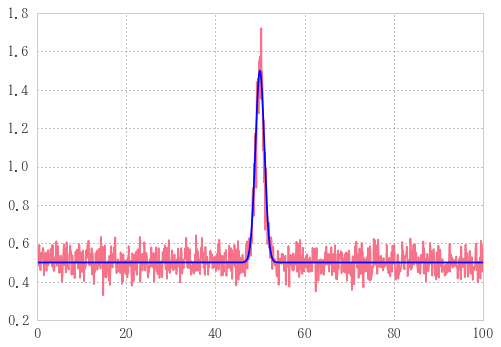

# 自作ガウシアン


```python
def gauss(x, a, mu, si):
    """
    a: 最大値
    mu: 位置
    si: 線幅
    noisef: 最低値
    """
    return aa * np.exp(-(x - mu)**2 / 2 / si**2) + noisef
```


```python
noisef=0.5
n=1001
x = np.linspace(0,100,n)
a, mu, si = 1, 50, 1
```


```python
g= gauss(x, a, mu, si); g
```


    array([ 0.5,  0.5,  0.5, ...,  0.5,  0.5,  0.5])


```python
plt.plot(x, g)
```


    [<matplotlib.lines.Line2D at 0x1771acb7898>]


## 自作ガウシアンじゃなくてscipy.stats.normを使うべきでは


```python
from  scipy.stats import norm
```


```python
z=norm.pdf(x, loc=50, scale=1)-0.5; z
```


    array([-0.5, -0.5, -0.5, ..., -0.5, -0.5, -0.5])


```python
plt.plot(x,z)
```


    [<matplotlib.lines.Line2D at 0x1771ad63fd0>]


```python
a, mu, si=1, 50, 1
df=pd.DataFrame({'norm': a*norm.pdf(x, loc=mu, scale=si)+noisef,
                 			'gauss': gauss(xx, a, mu, si)})
df.plot(style=['-', '--'])
```


    <matplotlib.axes._subplots.AxesSubplot at 0x1771af913c8>


## norm vs my_gauss
normでも自作gaussでも中でnp使っているんで実行速度あんま変わらないだろうとテスト


```python
%timeit gauss(x, a, mu, si)
```

    10000 loops, best of 3: 61.2 µs per loop
    


```python
%timeit norm.pdf(x, loc=50, scale=1)-0.5
```

    1000 loops, best of 3: 208 µs per loop
    

自作ガウスのほうが早い…！

## ガウシアンに沿ってノイズを作る

ということで自作のガウシアンを使っていきます。


```python
g = gauss(x, a, mu, si)
gnoise = g + 0.1 * np.random.randn(n)
```

ノイズを発生させる


```python
plt.plot(x, gnoise, '-')
plt.plot(x, g,'b-' )
```


    [<matplotlib.lines.Line2D at 0x1771d604a90>]





## カーブフィッティングをかけて、ノイズをフィッティングする

gからgnoiseを導き出したのだけれども、ここで急にgを未知の関数とみなしてしまう。
今あなたはgnoiseだけを知っていて、gのような関数を得たいとき、どうするか。

こういう時はカーブフィットを取る。
scipy.optimizeからcurve_fitをインポートしてくる。


```python
from scipy.optimize import curve_fit
```

次にフィッティングパラメータを定める。


```python
(a_, mu_, si_), _ = curve_fit(gauss, x, gnoise, (aa, mu, si))
yfit = gauss(x, a_, mu_, si_)
```

    C:\tools\Anaconda3\lib\site-packages\scipy\optimize\minpack.py:715: OptimizeWarning: Covariance of the parameters could not be estimated
      category=OptimizeWarning)
    


```python
plt.plot(xx, gnoise, '-')
plt.plot(xx, yfit, 'b-') 
```


    [<matplotlib.lines.Line2D at 0x1771d6c0128>]


さっきと同じグラフに見えるが、描いているのはgではなくyfitであることに注意

同じグラフに見えるということはフィッティングできたということ。

ノイズgnoiseをカーブフィットの引数に、aa_ ,


```python
curve_fit(gauss, xx, g, )
```


    ---------------------------------------------------------------------------

    NameError                                 Traceback (most recent call last)

    <ipython-input-41-7effad868376> in <module>()
    ----> 1 curve_fit(gauss, xx, g, )
    

    NameError: name 'curve_fit' is not defined


# scipy.stats.normを使った場合

## ガウシアンに沿ってノイズを作る


```python
from  scipy.stats import norm
```


```python
n=1001
xx = np.linspace(0,100,n)
aa, mu, si = 5, 50, 1
```


```python
def gauss2(x, a, mu, si):
    return a*norm.pdf(x, loc=mu, scale=si)-noisef
```


```python
g = gauss2(xx, aa, mu, si)
gnoise = g + 0.1 * np.random.randn(n)
```


```python
plt.plot(xx, gnoise, '.-')
plt.plot(xx, g,'r-' )
```


    [<matplotlib.lines.Line2D at 0x1ca7b0647f0>]


## カーブフィッティングをかけて、ノイズをフィッティングする

gからgnoiseを導き出したのだけれども、ここで急にgを未知の関数とみなしてしまう。
今あなたはgnoiseだけを知っていて、gのような関数を得たいとき、どうするか。


```python
from scipy.optimize import curve_fit
(aa_, mu_, si_), _ = curve_fit(gauss2, xx, gnoise, (aa, mu, si))
yfit = gauss2(xx,aa_, mu_, si_)
```


```python
plt.plot(xx, gnoise, '.-')
plt.plot(xx, yfit, 'r-')  # 描いているのはgではなく、yfitであることに注意
```


    [<matplotlib.lines.Line2D at 0x1ca7b1252e8>]


ちゃんとフィッティングできた。

# 自作ガウスをノイズのあるデータフレームにcarve_fitをapply

ランダムデータフレームの作成


```python
r=np.random.rand
df=pd.DataFrame([gauss(xx, r(), 10*_, 10*r()) + 0.1 * np.random.randn(n) for _ in range(10)]).T
df.plot()
```


    <matplotlib.axes._subplots.AxesSubplot at 0x1ca7edf1b38>


```python
df
```


<div>
<table border="1" class="dataframe">
  <thead>
    <tr style="text-align: right;">
      <th></th>
      <th>0</th>
      <th>1</th>
      <th>2</th>
      <th>3</th>
      <th>4</th>
      <th>5</th>
      <th>6</th>
      <th>7</th>
      <th>8</th>
      <th>9</th>
    </tr>
  </thead>
  <tbody>
    <tr>
      <th>0</th>
      <td>5.597369</td>
      <td>2.491744</td>
      <td>0.733125</td>
      <td>0.426366</td>
      <td>0.419702</td>
      <td>0.227654</td>
      <td>0.403233</td>
      <td>0.533165</td>
      <td>0.389243</td>
      <td>0.483341</td>
    </tr>
    <tr>
      <th>1</th>
      <td>5.371493</td>
      <td>2.283525</td>
      <td>0.672589</td>
      <td>0.358017</td>
      <td>0.513576</td>
      <td>0.348201</td>
      <td>0.381719</td>
      <td>0.475466</td>
      <td>0.679071</td>
      <td>0.472378</td>
    </tr>
    <tr>
      <th>2</th>
      <td>5.404454</td>
      <td>2.408595</td>
      <td>0.666219</td>
      <td>0.305359</td>
      <td>0.462288</td>
      <td>0.508339</td>
      <td>0.589907</td>
      <td>0.627878</td>
      <td>0.480787</td>
      <td>0.534739</td>
    </tr>
    <tr>
      <th>3</th>
      <td>5.442112</td>
      <td>2.614937</td>
      <td>0.538710</td>
      <td>0.368864</td>
      <td>0.582577</td>
      <td>0.654597</td>
      <td>0.605478</td>
      <td>0.618958</td>
      <td>0.699994</td>
      <td>0.654372</td>
    </tr>
    <tr>
      <th>4</th>
      <td>5.470499</td>
      <td>2.577172</td>
      <td>0.699745</td>
      <td>0.730829</td>
      <td>0.521940</td>
      <td>0.470914</td>
      <td>0.273079</td>
      <td>0.400499</td>
      <td>0.345927</td>
      <td>0.656044</td>
    </tr>
    <tr>
      <th>5</th>
      <td>5.540406</td>
      <td>2.702523</td>
      <td>0.876437</td>
      <td>0.512963</td>
      <td>0.519345</td>
      <td>0.581214</td>
      <td>0.394593</td>
      <td>0.327367</td>
      <td>0.378928</td>
      <td>0.540116</td>
    </tr>
    <tr>
      <th>6</th>
      <td>5.310536</td>
      <td>2.602038</td>
      <td>0.876960</td>
      <td>0.538471</td>
      <td>0.435745</td>
      <td>0.516698</td>
      <td>0.585007</td>
      <td>0.433421</td>
      <td>0.428050</td>
      <td>0.582952</td>
    </tr>
    <tr>
      <th>7</th>
      <td>5.468482</td>
      <td>2.680944</td>
      <td>0.846918</td>
      <td>0.435142</td>
      <td>0.471336</td>
      <td>0.615319</td>
      <td>0.572898</td>
      <td>0.469384</td>
      <td>0.498061</td>
      <td>0.309730</td>
    </tr>
    <tr>
      <th>8</th>
      <td>5.462557</td>
      <td>2.936858</td>
      <td>0.845211</td>
      <td>0.511337</td>
      <td>0.722132</td>
      <td>0.492076</td>
      <td>0.587620</td>
      <td>0.725781</td>
      <td>0.454297</td>
      <td>0.537739</td>
    </tr>
    <tr>
      <th>9</th>
      <td>5.585699</td>
      <td>2.722369</td>
      <td>0.702719</td>
      <td>0.454148</td>
      <td>0.677273</td>
      <td>0.575513</td>
      <td>0.462599</td>
      <td>0.350746</td>
      <td>0.567357</td>
      <td>0.466152</td>
    </tr>
    <tr>
      <th>10</th>
      <td>5.451803</td>
      <td>3.007855</td>
      <td>0.680204</td>
      <td>0.414993</td>
      <td>0.444310</td>
      <td>0.631139</td>
      <td>0.410763</td>
      <td>0.629340</td>
      <td>0.523540</td>
      <td>0.509943</td>
    </tr>
    <tr>
      <th>11</th>
      <td>5.375439</td>
      <td>3.048622</td>
      <td>0.664393</td>
      <td>0.464717</td>
      <td>0.375013</td>
      <td>0.436689</td>
      <td>0.601983</td>
      <td>0.371233</td>
      <td>0.516394</td>
      <td>0.488176</td>
    </tr>
    <tr>
      <th>12</th>
      <td>5.361794</td>
      <td>2.751884</td>
      <td>0.784254</td>
      <td>0.395592</td>
      <td>0.177046</td>
      <td>0.429038</td>
      <td>0.615890</td>
      <td>0.358666</td>
      <td>0.418843</td>
      <td>0.431901</td>
    </tr>
    <tr>
      <th>13</th>
      <td>5.411583</td>
      <td>2.994537</td>
      <td>0.806360</td>
      <td>0.629417</td>
      <td>0.648305</td>
      <td>0.521529</td>
      <td>0.509157</td>
      <td>0.523809</td>
      <td>0.562637</td>
      <td>0.711773</td>
    </tr>
    <tr>
      <th>14</th>
      <td>5.256608</td>
      <td>2.982252</td>
      <td>0.838890</td>
      <td>0.618449</td>
      <td>0.289400</td>
      <td>0.418421</td>
      <td>0.523785</td>
      <td>0.493413</td>
      <td>0.506701</td>
      <td>0.514231</td>
    </tr>
    <tr>
      <th>15</th>
      <td>5.342818</td>
      <td>3.007603</td>
      <td>0.997556</td>
      <td>0.433702</td>
      <td>0.523265</td>
      <td>0.533067</td>
      <td>0.563150</td>
      <td>0.641980</td>
      <td>0.535740</td>
      <td>0.331411</td>
    </tr>
    <tr>
      <th>16</th>
      <td>5.244125</td>
      <td>3.111454</td>
      <td>0.918999</td>
      <td>0.535001</td>
      <td>0.471404</td>
      <td>0.483314</td>
      <td>0.514697</td>
      <td>0.444800</td>
      <td>0.543031</td>
      <td>0.449403</td>
    </tr>
    <tr>
      <th>17</th>
      <td>5.508224</td>
      <td>2.940717</td>
      <td>0.804261</td>
      <td>0.288440</td>
      <td>0.644840</td>
      <td>0.458704</td>
      <td>0.638245</td>
      <td>0.795494</td>
      <td>0.487640</td>
      <td>0.431087</td>
    </tr>
    <tr>
      <th>18</th>
      <td>5.482285</td>
      <td>3.143831</td>
      <td>0.892610</td>
      <td>0.553807</td>
      <td>0.735834</td>
      <td>0.297176</td>
      <td>0.559478</td>
      <td>0.469441</td>
      <td>0.579071</td>
      <td>0.586415</td>
    </tr>
    <tr>
      <th>19</th>
      <td>5.318173</td>
      <td>3.215015</td>
      <td>0.966214</td>
      <td>0.519508</td>
      <td>0.420968</td>
      <td>0.650899</td>
      <td>0.412799</td>
      <td>0.537406</td>
      <td>0.513715</td>
      <td>0.509629</td>
    </tr>
    <tr>
      <th>20</th>
      <td>5.357420</td>
      <td>3.272429</td>
      <td>0.907049</td>
      <td>0.645977</td>
      <td>0.443294</td>
      <td>0.498471</td>
      <td>0.455462</td>
      <td>0.379580</td>
      <td>0.392029</td>
      <td>0.407147</td>
    </tr>
    <tr>
      <th>21</th>
      <td>5.122213</td>
      <td>3.216044</td>
      <td>0.956133</td>
      <td>0.502512</td>
      <td>0.427497</td>
      <td>0.513943</td>
      <td>0.566202</td>
      <td>0.374241</td>
      <td>0.603917</td>
      <td>0.473370</td>
    </tr>
    <tr>
      <th>22</th>
      <td>5.305494</td>
      <td>3.512360</td>
      <td>0.779527</td>
      <td>0.466461</td>
      <td>0.412243</td>
      <td>0.463515</td>
      <td>0.503193</td>
      <td>0.382609</td>
      <td>0.517925</td>
      <td>0.608052</td>
    </tr>
    <tr>
      <th>23</th>
      <td>5.301713</td>
      <td>3.412254</td>
      <td>1.103316</td>
      <td>0.664051</td>
      <td>0.516016</td>
      <td>0.639328</td>
      <td>0.493205</td>
      <td>0.620014</td>
      <td>0.327077</td>
      <td>0.279768</td>
    </tr>
    <tr>
      <th>24</th>
      <td>5.425871</td>
      <td>3.380619</td>
      <td>0.907209</td>
      <td>0.438601</td>
      <td>0.472873</td>
      <td>0.506405</td>
      <td>0.688849</td>
      <td>0.545242</td>
      <td>0.516321</td>
      <td>0.495138</td>
    </tr>
    <tr>
      <th>25</th>
      <td>5.087005</td>
      <td>3.401140</td>
      <td>0.948291</td>
      <td>0.487906</td>
      <td>0.535692</td>
      <td>0.610918</td>
      <td>0.411415</td>
      <td>0.484561</td>
      <td>0.573590</td>
      <td>0.514847</td>
    </tr>
    <tr>
      <th>26</th>
      <td>5.229490</td>
      <td>3.619952</td>
      <td>1.026871</td>
      <td>0.534270</td>
      <td>0.452990</td>
      <td>0.644539</td>
      <td>0.619545</td>
      <td>0.364258</td>
      <td>0.409429</td>
      <td>0.544966</td>
    </tr>
    <tr>
      <th>27</th>
      <td>5.344814</td>
      <td>3.701071</td>
      <td>0.971408</td>
      <td>0.472486</td>
      <td>0.469725</td>
      <td>0.465522</td>
      <td>0.468515</td>
      <td>0.565667</td>
      <td>0.498264</td>
      <td>0.344183</td>
    </tr>
    <tr>
      <th>28</th>
      <td>5.155957</td>
      <td>3.503784</td>
      <td>1.116167</td>
      <td>0.417715</td>
      <td>0.614832</td>
      <td>0.546313</td>
      <td>0.482737</td>
      <td>0.534665</td>
      <td>0.599544</td>
      <td>0.576264</td>
    </tr>
    <tr>
      <th>29</th>
      <td>5.240593</td>
      <td>3.730122</td>
      <td>1.126189</td>
      <td>0.425476</td>
      <td>0.469525</td>
      <td>0.539609</td>
      <td>0.548304</td>
      <td>0.531256</td>
      <td>0.488020</td>
      <td>0.474191</td>
    </tr>
    <tr>
      <th>...</th>
      <td>...</td>
      <td>...</td>
      <td>...</td>
      <td>...</td>
      <td>...</td>
      <td>...</td>
      <td>...</td>
      <td>...</td>
      <td>...</td>
      <td>...</td>
    </tr>
    <tr>
      <th>971</th>
      <td>0.529527</td>
      <td>0.358364</td>
      <td>0.518804</td>
      <td>0.508925</td>
      <td>0.469721</td>
      <td>0.517780</td>
      <td>0.401886</td>
      <td>0.503037</td>
      <td>0.455741</td>
      <td>3.513332</td>
    </tr>
    <tr>
      <th>972</th>
      <td>0.570905</td>
      <td>0.570684</td>
      <td>0.485860</td>
      <td>0.531205</td>
      <td>0.531835</td>
      <td>0.455022</td>
      <td>0.411613</td>
      <td>0.576960</td>
      <td>0.567804</td>
      <td>3.465799</td>
    </tr>
    <tr>
      <th>973</th>
      <td>0.538151</td>
      <td>0.492142</td>
      <td>0.434020</td>
      <td>0.517494</td>
      <td>0.405069</td>
      <td>0.502615</td>
      <td>0.528098</td>
      <td>0.535034</td>
      <td>0.688973</td>
      <td>3.552700</td>
    </tr>
    <tr>
      <th>974</th>
      <td>0.695607</td>
      <td>0.464005</td>
      <td>0.589509</td>
      <td>0.382336</td>
      <td>0.284839</td>
      <td>0.546475</td>
      <td>0.448177</td>
      <td>0.522426</td>
      <td>0.571570</td>
      <td>3.440994</td>
    </tr>
    <tr>
      <th>975</th>
      <td>0.467149</td>
      <td>0.480584</td>
      <td>0.730452</td>
      <td>0.529331</td>
      <td>0.316480</td>
      <td>0.652525</td>
      <td>0.699035</td>
      <td>0.379110</td>
      <td>0.735272</td>
      <td>3.425690</td>
    </tr>
    <tr>
      <th>976</th>
      <td>0.486802</td>
      <td>0.621752</td>
      <td>0.466356</td>
      <td>0.424038</td>
      <td>0.436477</td>
      <td>0.393675</td>
      <td>0.588680</td>
      <td>0.289292</td>
      <td>0.413897</td>
      <td>3.543143</td>
    </tr>
    <tr>
      <th>977</th>
      <td>0.597498</td>
      <td>0.524932</td>
      <td>0.378288</td>
      <td>0.686271</td>
      <td>0.604843</td>
      <td>0.645858</td>
      <td>0.428697</td>
      <td>0.437891</td>
      <td>0.390546</td>
      <td>3.421482</td>
    </tr>
    <tr>
      <th>978</th>
      <td>0.504545</td>
      <td>0.488356</td>
      <td>0.565382</td>
      <td>0.561487</td>
      <td>0.401006</td>
      <td>0.246389</td>
      <td>0.637548</td>
      <td>0.527797</td>
      <td>0.526253</td>
      <td>3.091326</td>
    </tr>
    <tr>
      <th>979</th>
      <td>0.588539</td>
      <td>0.445362</td>
      <td>0.610363</td>
      <td>0.416822</td>
      <td>0.423090</td>
      <td>0.480760</td>
      <td>0.521885</td>
      <td>0.639860</td>
      <td>0.473672</td>
      <td>3.329477</td>
    </tr>
    <tr>
      <th>980</th>
      <td>0.363860</td>
      <td>0.595131</td>
      <td>0.460711</td>
      <td>0.414400</td>
      <td>0.499292</td>
      <td>0.350316</td>
      <td>0.593611</td>
      <td>0.580763</td>
      <td>0.367872</td>
      <td>3.116402</td>
    </tr>
    <tr>
      <th>981</th>
      <td>0.510585</td>
      <td>0.458049</td>
      <td>0.506779</td>
      <td>0.331216</td>
      <td>0.603508</td>
      <td>0.714678</td>
      <td>0.482229</td>
      <td>0.692771</td>
      <td>0.545456</td>
      <td>3.207887</td>
    </tr>
    <tr>
      <th>982</th>
      <td>0.523079</td>
      <td>0.478417</td>
      <td>0.481810</td>
      <td>0.698801</td>
      <td>0.619204</td>
      <td>0.443535</td>
      <td>0.768091</td>
      <td>0.488256</td>
      <td>0.569622</td>
      <td>3.238895</td>
    </tr>
    <tr>
      <th>983</th>
      <td>0.487650</td>
      <td>0.174102</td>
      <td>0.460394</td>
      <td>0.497958</td>
      <td>0.281023</td>
      <td>0.420088</td>
      <td>0.503620</td>
      <td>0.566762</td>
      <td>0.505168</td>
      <td>3.019683</td>
    </tr>
    <tr>
      <th>984</th>
      <td>0.661865</td>
      <td>0.494130</td>
      <td>0.374135</td>
      <td>0.391099</td>
      <td>0.406086</td>
      <td>0.470165</td>
      <td>0.615145</td>
      <td>0.521005</td>
      <td>0.556195</td>
      <td>3.060549</td>
    </tr>
    <tr>
      <th>985</th>
      <td>0.400929</td>
      <td>0.445215</td>
      <td>0.376943</td>
      <td>0.399289</td>
      <td>0.445184</td>
      <td>0.440187</td>
      <td>0.509358</td>
      <td>0.319576</td>
      <td>0.440069</td>
      <td>3.086088</td>
    </tr>
    <tr>
      <th>986</th>
      <td>0.507672</td>
      <td>0.338248</td>
      <td>0.545798</td>
      <td>0.332737</td>
      <td>0.450288</td>
      <td>0.398284</td>
      <td>0.522222</td>
      <td>0.520412</td>
      <td>0.446365</td>
      <td>2.966154</td>
    </tr>
    <tr>
      <th>987</th>
      <td>0.516138</td>
      <td>0.465051</td>
      <td>0.537397</td>
      <td>0.400523</td>
      <td>0.359414</td>
      <td>0.578210</td>
      <td>0.570657</td>
      <td>0.360520</td>
      <td>0.527551</td>
      <td>2.855009</td>
    </tr>
    <tr>
      <th>988</th>
      <td>0.458368</td>
      <td>0.644095</td>
      <td>0.304990</td>
      <td>0.713620</td>
      <td>0.395202</td>
      <td>0.575578</td>
      <td>0.504727</td>
      <td>0.382075</td>
      <td>0.534081</td>
      <td>2.882697</td>
    </tr>
    <tr>
      <th>989</th>
      <td>0.578799</td>
      <td>0.544700</td>
      <td>0.432208</td>
      <td>0.632347</td>
      <td>0.473547</td>
      <td>0.492220</td>
      <td>0.512959</td>
      <td>0.414103</td>
      <td>0.421339</td>
      <td>2.893854</td>
    </tr>
    <tr>
      <th>990</th>
      <td>0.507931</td>
      <td>0.564896</td>
      <td>0.561564</td>
      <td>0.632974</td>
      <td>0.456140</td>
      <td>0.593617</td>
      <td>0.599453</td>
      <td>0.577719</td>
      <td>0.583834</td>
      <td>2.746718</td>
    </tr>
    <tr>
      <th>991</th>
      <td>0.386961</td>
      <td>0.610369</td>
      <td>0.604871</td>
      <td>0.546918</td>
      <td>0.431926</td>
      <td>0.497580</td>
      <td>0.317693</td>
      <td>0.494314</td>
      <td>0.504280</td>
      <td>2.694819</td>
    </tr>
    <tr>
      <th>992</th>
      <td>0.345045</td>
      <td>0.674554</td>
      <td>0.716921</td>
      <td>0.409767</td>
      <td>0.592302</td>
      <td>0.586203</td>
      <td>0.409655</td>
      <td>0.517307</td>
      <td>0.383445</td>
      <td>2.690836</td>
    </tr>
    <tr>
      <th>993</th>
      <td>0.486019</td>
      <td>0.625405</td>
      <td>0.406408</td>
      <td>0.503068</td>
      <td>0.539495</td>
      <td>0.424461</td>
      <td>0.650300</td>
      <td>0.439676</td>
      <td>0.499172</td>
      <td>2.537751</td>
    </tr>
    <tr>
      <th>994</th>
      <td>0.277675</td>
      <td>0.568684</td>
      <td>0.539973</td>
      <td>0.464318</td>
      <td>0.585494</td>
      <td>0.562993</td>
      <td>0.290822</td>
      <td>0.449345</td>
      <td>0.501448</td>
      <td>2.781229</td>
    </tr>
    <tr>
      <th>995</th>
      <td>0.589740</td>
      <td>0.513033</td>
      <td>0.434523</td>
      <td>0.474935</td>
      <td>0.547204</td>
      <td>0.518632</td>
      <td>0.322042</td>
      <td>0.512121</td>
      <td>0.469037</td>
      <td>2.628345</td>
    </tr>
    <tr>
      <th>996</th>
      <td>0.520975</td>
      <td>0.478294</td>
      <td>0.480557</td>
      <td>0.484006</td>
      <td>0.492193</td>
      <td>0.573760</td>
      <td>0.404691</td>
      <td>0.453396</td>
      <td>0.505707</td>
      <td>2.635399</td>
    </tr>
    <tr>
      <th>997</th>
      <td>0.632657</td>
      <td>0.574674</td>
      <td>0.426212</td>
      <td>0.407222</td>
      <td>0.546620</td>
      <td>0.636246</td>
      <td>0.486812</td>
      <td>0.467546</td>
      <td>0.505422</td>
      <td>2.339973</td>
    </tr>
    <tr>
      <th>998</th>
      <td>0.610188</td>
      <td>0.413633</td>
      <td>0.415747</td>
      <td>0.572865</td>
      <td>0.491659</td>
      <td>0.618372</td>
      <td>0.432174</td>
      <td>0.594590</td>
      <td>0.525399</td>
      <td>2.344469</td>
    </tr>
    <tr>
      <th>999</th>
      <td>0.619413</td>
      <td>0.470054</td>
      <td>0.313583</td>
      <td>0.452011</td>
      <td>0.584379</td>
      <td>0.397621</td>
      <td>0.491145</td>
      <td>0.573142</td>
      <td>0.508595</td>
      <td>2.453842</td>
    </tr>
    <tr>
      <th>1000</th>
      <td>0.478073</td>
      <td>0.519888</td>
      <td>0.412258</td>
      <td>0.438218</td>
      <td>0.469740</td>
      <td>0.327760</td>
      <td>0.541827</td>
      <td>0.364946</td>
      <td>0.655199</td>
      <td>2.413007</td>
    </tr>
  </tbody>
</table>
<p>1001 rows × 10 columns</p>
</div>


```python
f=lambda x: curve_fit(gauss, xx, x, (aa, mu, si), maxfev = 100000000)
```


```python
fit_param, convariance = df.apply(f)
```

    C:\tools\Anaconda3\lib\site-packages\scipy\optimize\minpack.py:715: OptimizeWarning: Covariance of the parameters could not be estimated
      category=OptimizeWarning)
    


    ---------------------------------------------------------------------------

    ValueError                                Traceback (most recent call last)

    <ipython-input-115-73129f1102c1> in <module>()
    ----> 1 fit_param, convariance = df.apply(f)
    

    ValueError: too many values to unpack (expected 2)


```python
fit_
```


```python

```
